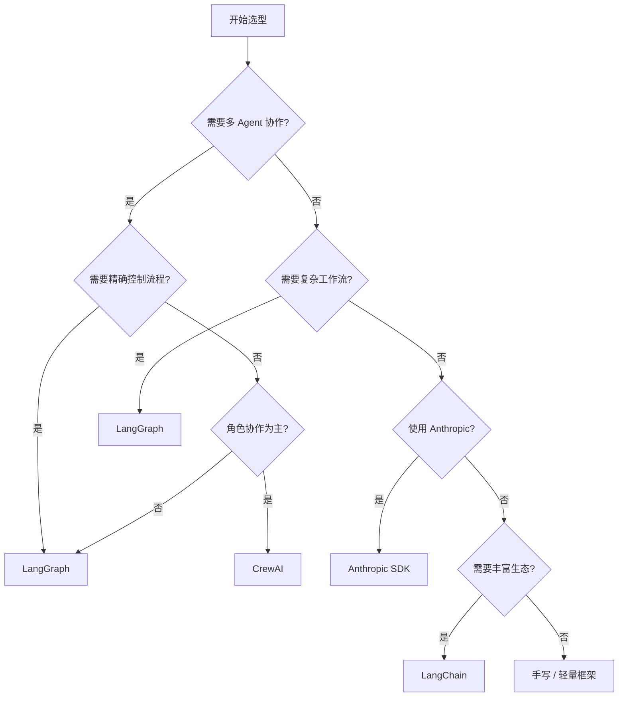

# Agent 框架入门：从手写到框架

::: tip 学习目标
- 理解框架解决的核心问题，掌握"手写 vs 框架"的决策方法
- 了解主流 Agent 框架的定位和选型策略
- 掌握 LangChain 的核心概念：LCEL、Chain、工具集成、输出解析器

**学完你能做到：** 根据项目需求选择合适的框架（或决定不用框架），用 LangChain 构建一个带工具调用的完整 Agent。
:::

## 为什么需要框架

手写一个 Agent 循环其实很简单，50 行代码就够了：

```typescript
import Anthropic from "@anthropic-ai/sdk";

const client = new Anthropic();

async function simpleAgent(
  question: string,
  tools: Anthropic.Tool[],
  maxSteps: number = 5
): Promise<string> {
  // 50 行的手写 Agent
  const messages: Anthropic.MessageParam[] = [
    { role: "user", content: question },
  ];

  for (let i = 0; i < maxSteps; i++) {
    const response = await client.messages.create({
      model: "claude-sonnet-4-20250514",
      max_tokens: 1024,
      tools,
      messages,
    });

    if (response.stop_reason === "end_turn") {
      const textBlock = response.content.find((b) => b.type === "text");
      return textBlock?.type === "text" ? textBlock.text : "";
    }

    for (const block of response.content) {
      if (block.type === "tool_use") {
        const result = executeTool(block.name, block.input);
        messages.push({ role: "assistant", content: response.content });
        messages.push({
          role: "user",
          content: [
            { type: "tool_result", tool_use_id: block.id, content: result },
          ],
        });
      }
    }
  }

  return "达到最大步数";
}
```

这段代码能跑，但在生产中你很快会发现它缺少太多东西：

| 手写代码缺少的 | 框架帮你解决的 |
|--------------|-------------|
| 统一的工具定义接口 | 工具装饰器/注册器，自动生成 schema |
| 复杂工作流中的状态管理 | StateGraph、Checkpointing |
| 错误处理和重试 | 内置重试、超时、降级 |
| 可观测性 | 自动 Tracing、Logging |
| 社区组件复用 | 现成的 Retriever、Parser、Tool |

::: warning 过度工程化警告
框架不是银弹。以下情况考虑不用框架：
1. 简单的单轮问答 -- 直接调 API 就行
2. 原型验证阶段 -- 框架学习成本可能超过收益
3. 极端性能要求 -- 框架抽象层有额外开销
4. 你完全理解每个环节 -- 手写代码可控性更好
:::

## 框架选型指南

当前主流框架各有侧重：

| 框架 | 定位 | 复杂度 | 核心特点 | 适用场景 |
|------|------|--------|---------|---------|
| **LangChain** | 通用 LLM 开发框架 | 中 | Chain/Tool 抽象，生态最大 | 通用 Agent、RAG |
| **LangGraph** | 工作流编排引擎 | 中高 | 状态图，精确控制流 | 复杂工作流 |
| **CrewAI** | 多角色协作框架 | 低 | Agent-Task-Crew 模型 | 多 Agent 协作 |
| **Anthropic Agent SDK** | 轻量 Agent SDK | 低 | Handoff，极简设计 | Claude 深度集成 |
| **AutoGen** | 对话式多 Agent | 中 | 对话驱动协作 | 研究/对话 Agent |

### 选型决策树



::: info 选型总结
- 需要快速原型 + 丰富集成 -> LangChain
- 需要精确流程控制 + 状态持久化 -> LangGraph
- 需要多角色协作 + 简单上手 -> CrewAI
- 使用 Claude + 追求极简 -> Anthropic SDK
- 以上都不满足 -> 手写或自建框架（见高级篇）
:::

## LangChain 核心概念入门

LangChain 是目前生态最大的 LLM 应用开发框架，我们从它开始入门。

### 安装

```bash
npm install langchain @langchain/openai @langchain/anthropic
```

### LCEL（LangChain Expression Language）

LCEL 是 LangChain 的核心编程范式 -- 用 `|` 管道符将组件串联。

> 以下是 **Python 框架代码**，展示 LangChain LCEL 的管道语法。这是 LangChain 独有的设计模式，无法直接映射到 TypeScript。

```python
from langchain_openai import ChatOpenAI
from langchain_core.prompts import ChatPromptTemplate
from langchain_core.output_parsers import StrOutputParser

# 创建组件
prompt = ChatPromptTemplate.from_messages([
    ("system", "你是一个{role}。"),
    ("user", "{question}"),
])

model = ChatOpenAI(model="gpt-4o-mini")
parser = StrOutputParser()

# 用 | 管道连接：Prompt -> Model -> Parser
chain = prompt | model | parser

# 调用
result = chain.invoke({
    "role": "Python 专家",
    "question": "解释 Python 的 GIL 是什么",
})
print(result)
```

**等价的裸 SDK 实现（TypeScript）** -- 用函数组合表达同样的管道思路：

```typescript
import Anthropic from "@anthropic-ai/sdk";

const client = new Anthropic();

// 管道的本质：Prompt 填充 -> 模型调用 -> 输出解析
// 用函数组合替代 LCEL 的 | 管道符
type PipelineStep<In, Out> = (input: In) => Promise<Out>;

function pipe<A, B, C>(
  fn1: PipelineStep<A, B>,
  fn2: PipelineStep<B, C>
): PipelineStep<A, C> {
  return async (input: A) => fn2(await fn1(input));
}

// 步骤 1：Prompt 填充
async function fillPrompt(vars: {
  role: string;
  question: string;
}): Promise<Anthropic.MessageParam[]> {
  return [
    {
      role: "user",
      content: `你是一个${vars.role}。\n\n${vars.question}`,
    },
  ];
}

// 步骤 2：模型调用 + 输出解析
async function callAndParse(
  messages: Anthropic.MessageParam[]
): Promise<string> {
  const response = await client.messages.create({
    model: "claude-sonnet-4-20250514",
    max_tokens: 1024,
    messages,
  });
  const textBlock = response.content.find((b) => b.type === "text");
  return textBlock?.type === "text" ? textBlock.text : "";
}

// 组合管道
const chain = pipe(fillPrompt, callAndParse);

const result = await chain({
  role: "TypeScript 专家",
  question: "解释 TypeScript 的类型体操是什么",
});
console.log(result);
```

LCEL 的 `Runnable` 接口让每个组件自动获得多种调用方式：

> 以下是 **Python 框架代码**，展示 LangChain Runnable 的统一接口设计。

```python
# 同步调用
result = chain.invoke({"question": "..."})

# 异步调用
result = await chain.ainvoke({"question": "..."})

# 流式输出
for chunk in chain.stream({"question": "..."}):
    print(chunk, end="", flush=True)

# 批量调用
results = chain.batch([
    {"question": "问题1"},
    {"question": "问题2"},
])
```

**等价的裸 SDK 实现（TypeScript）** -- 用 Anthropic SDK 原生支持流式和批量：

```typescript
import Anthropic from "@anthropic-ai/sdk";

const client = new Anthropic();

// 普通调用
const result = await client.messages.create({
  model: "claude-sonnet-4-20250514",
  max_tokens: 1024,
  messages: [{ role: "user", content: "..." }],
});

// 流式输出
const stream = client.messages.stream({
  model: "claude-sonnet-4-20250514",
  max_tokens: 1024,
  messages: [{ role: "user", content: "..." }],
});
for await (const event of stream) {
  if (
    event.type === "content_block_delta" &&
    event.delta.type === "text_delta"
  ) {
    process.stdout.write(event.delta.text);
  }
}

// 批量调用
const questions = ["问题1", "问题2"];
const results = await Promise.all(
  questions.map((q) =>
    client.messages.create({
      model: "claude-sonnet-4-20250514",
      max_tokens: 1024,
      messages: [{ role: "user", content: q }],
    })
  )
);
```

### 工具集成

LangChain 用 `@tool` 装饰器统一定义工具：

> 以下是 **Python 框架代码**，展示 LangChain 的 `@tool` 装饰器模式。

```python
from langchain_core.tools import tool
from langchain_openai import ChatOpenAI

@tool
def search_web(query: str) -> str:
    """搜索互联网获取最新信息"""
    return f"搜索 '{query}' 的结果: ..."

@tool
def calculate(expression: str) -> str:
    """计算数学表达式"""
    try:
        return str(eval(expression))
    except Exception as e:
        return f"计算错误: {e}"

@tool
def get_weather(city: str) -> str:
    """获取指定城市的天气信息"""
    return f"{city}的天气: 晴，25°C"

# 将工具绑定到模型
tools = [search_web, calculate, get_weather]
model_with_tools = ChatOpenAI(model="gpt-4o-mini").bind_tools(tools)

# 调用 -- 模型会自动决定是否使用工具
response = model_with_tools.invoke("北京今天天气怎么样？")
print(response.tool_calls)  # 模型选择了 get_weather 工具
```

**等价的裸 SDK 实现（TypeScript）** -- 用 Anthropic SDK 的 tool_use 能力：

```typescript
import Anthropic from "@anthropic-ai/sdk";

const client = new Anthropic();

// 定义工具（手动编写 JSON Schema，等价于 @tool 装饰器的自动生成）
const tools: Anthropic.Tool[] = [
  {
    name: "search_web",
    description: "搜索互联网获取最新信息",
    input_schema: {
      type: "object" as const,
      properties: { query: { type: "string" } },
      required: ["query"],
    },
  },
  {
    name: "calculate",
    description: "计算数学表达式",
    input_schema: {
      type: "object" as const,
      properties: { expression: { type: "string" } },
      required: ["expression"],
    },
  },
  {
    name: "get_weather",
    description: "获取指定城市的天气信息",
    input_schema: {
      type: "object" as const,
      properties: { city: { type: "string" } },
      required: ["city"],
    },
  },
];

// 工具处理函数
function executeTool(name: string, input: Record<string, string>): string {
  switch (name) {
    case "search_web":
      return `搜索 '${input.query}' 的结果: ...`;
    case "calculate":
      try {
        return String(eval(input.expression));
      } catch (e) {
        return `计算错误: ${e}`;
      }
    case "get_weather":
      return `${input.city}的天气: 晴，25°C`;
    default:
      return `未知工具: ${name}`;
  }
}

// 调用 -- 模型会自动决定是否使用工具
const response = await client.messages.create({
  model: "claude-sonnet-4-20250514",
  max_tokens: 1024,
  tools,
  messages: [{ role: "user", content: "北京今天天气怎么样？" }],
});

for (const block of response.content) {
  if (block.type === "tool_use") {
    console.log("工具调用:", block.name, block.input);
  }
}
```

### 输出解析器

将 LLM 的自由文本输出解析为结构化数据：

> 以下是 **Python 框架代码**，展示 LangChain 的输出解析器如何将 LLM 输出约束为结构化类型。

```python
from langchain_core.output_parsers import JsonOutputParser
from langchain_core.pydantic_v1 import BaseModel, Field

class BookReview(BaseModel):
    title: str = Field(description="书名")
    rating: int = Field(description="评分 1-5")
    summary: str = Field(description="一句话总结")

parser = JsonOutputParser(pydantic_object=BookReview)

prompt = ChatPromptTemplate.from_messages([
    ("system", "你是一个书评专家。{format_instructions}"),
    ("user", "评价《{book}》"),
])

chain = prompt | model | parser
result = chain.invoke({
    "book": "人类简史",
    "format_instructions": parser.get_format_instructions(),
})
print(result)
# {"title": "人类简史", "rating": 5, "summary": "..."}
```

**等价的裸 SDK 实现（TypeScript）** -- 用 Anthropic SDK 的 tool_use 实现结构化输出：

```typescript
import Anthropic from "@anthropic-ai/sdk";

const client = new Anthropic();

// 用 TypeScript interface 定义输出结构（等价于 Pydantic BaseModel）
interface BookReview {
  title: string; // 书名
  rating: number; // 评分 1-5
  summary: string; // 一句话总结
}

// 用 tool_use 强制 LLM 返回结构化数据
const response = await client.messages.create({
  model: "claude-sonnet-4-20250514",
  max_tokens: 1024,
  tools: [
    {
      name: "book_review",
      description: "输出结构化的书评",
      input_schema: {
        type: "object" as const,
        properties: {
          title: { type: "string", description: "书名" },
          rating: { type: "integer", description: "评分 1-5" },
          summary: { type: "string", description: "一句话总结" },
        },
        required: ["title", "rating", "summary"],
      },
    },
  ],
  tool_choice: { type: "tool", name: "book_review" },
  messages: [{ role: "user", content: '评价《人类简史》' }],
});

const toolBlock = response.content.find((b) => b.type === "tool_use");
if (toolBlock?.type === "tool_use") {
  const review = toolBlock.input as BookReview;
  console.log(review);
  // { title: "人类简史", rating: 5, summary: "..." }
}
```

### 完整示例：用 LangChain 构建 Agent

> 以下是 **Python 框架代码**，展示 LangChain + LangGraph 的 `create_react_agent` 一站式构建方式。

```python
from langchain_openai import ChatOpenAI
from langchain_core.tools import tool
from langchain_core.messages import HumanMessage
from langgraph.prebuilt import create_react_agent

@tool
def search_knowledge(query: str) -> str:
    """在知识库中搜索信息"""
    knowledge = {
        "python": "Python 是一种解释型编程语言，由 Guido van Rossum 在 1991 年发布。",
        "javascript": "JavaScript 是 Web 前端的核心编程语言。",
    }
    for key, value in knowledge.items():
        if key in query.lower():
            return value
    return "未找到相关信息"

@tool
def calculate_math(expression: str) -> str:
    """执行数学计算"""
    try:
        result = eval(expression)
        return f"计算结果: {result}"
    except Exception as e:
        return f"计算错误: {e}"

# 创建 Agent
model = ChatOpenAI(model="gpt-4o-mini")
tools = [search_knowledge, calculate_math]
agent = create_react_agent(model, tools)

# 使用 Agent
result = agent.invoke({
    "messages": [HumanMessage(content="Python 是什么语言？它诞生于哪一年？")]
})

for message in result["messages"]:
    print(f"[{message.type}] {message.content[:200]}")
```

**等价的裸 SDK 实现（TypeScript）** -- 手写 Agent 循环，实现同样的 ReAct 模式：

```typescript
import Anthropic from "@anthropic-ai/sdk";

const client = new Anthropic();

// 定义知识库搜索工具
function searchKnowledge(query: string): string {
  const knowledge: Record<string, string> = {
    python: "Python 是一种解释型编程语言，由 Guido van Rossum 在 1991 年发布。",
    javascript: "JavaScript 是 Web 前端的核心编程语言。",
  };
  for (const [key, value] of Object.entries(knowledge)) {
    if (query.toLowerCase().includes(key)) return value;
  }
  return "未找到相关信息";
}

// 定义计算工具
function calculateMath(expression: string): string {
  try {
    return `计算结果: ${eval(expression)}`;
  } catch (e) {
    return `计算错误: ${e}`;
  }
}

// 工具定义
const tools: Anthropic.Tool[] = [
  {
    name: "search_knowledge",
    description: "在知识库中搜索信息",
    input_schema: {
      type: "object" as const,
      properties: { query: { type: "string" } },
      required: ["query"],
    },
  },
  {
    name: "calculate_math",
    description: "执行数学计算",
    input_schema: {
      type: "object" as const,
      properties: { expression: { type: "string" } },
      required: ["expression"],
    },
  },
];

// 工具执行
function executeTool(
  name: string,
  input: Record<string, string>
): string {
  if (name === "search_knowledge") return searchKnowledge(input.query);
  if (name === "calculate_math") return calculateMath(input.expression);
  return `未知工具: ${name}`;
}

// Agent 循环（等价于 create_react_agent）
async function reactAgent(question: string): Promise<void> {
  const messages: Anthropic.MessageParam[] = [
    { role: "user", content: question },
  ];

  for (let i = 0; i < 5; i++) {
    const response = await client.messages.create({
      model: "claude-sonnet-4-20250514",
      max_tokens: 1024,
      tools,
      messages,
    });

    console.log(`[assistant] ${response.content.map((b) => (b.type === "text" ? b.text : `[tool_use: ${b.name}]`)).join(" ")}`);

    if (response.stop_reason === "end_turn") break;

    // 处理工具调用
    const toolResults: Anthropic.ToolResultBlockParam[] = [];
    for (const block of response.content) {
      if (block.type === "tool_use") {
        const result = executeTool(
          block.name,
          block.input as Record<string, string>
        );
        console.log(`[tool: ${block.name}] ${result}`);
        toolResults.push({
          type: "tool_result",
          tool_use_id: block.id,
          content: result,
        });
      }
    }

    messages.push({ role: "assistant", content: response.content });
    messages.push({ role: "user", content: toolResults });
  }
}

await reactAgent("Python 是什么语言？它诞生于哪一年？");
```

::: warning LangChain 的学习曲线
LangChain 的抽象层次较多（Runnable, Chain, Agent, Retriever...），初学者可能会感到困惑。建议：先掌握 LCEL 管道，再逐步学习其他概念。不要试图一次理解所有抽象。
:::

## 小结

- 框架帮你解决工具集成、状态管理、错误处理、可观测性等"不显眼但重要"的问题
- 选型关键：任务复杂度决定框架选择，简单场景手写更直接
- LangChain 的核心是 LCEL 管道 -- 用 `|` 组合 Prompt、Model、Parser 等组件（Python 专属语法，TypeScript 中用函数组合表达相同思想）
- `@tool` 装饰器统一工具定义（TypeScript 中用 JSON Schema 手动定义），`create_react_agent` 快速创建 Agent
- 输出解析器将 LLM 自由文本转换为结构化数据

## 练习题

1. 用手写代码和 LangChain 分别实现同一个简单 Agent（带搜索和计算工具），对比代码量和可读性。
2. 分析你正在做的一个项目，按决策树选择最合适的框架，并说明理由。
3. 用 LCEL 构建一个翻译 Chain：接受中文输入，输出英文翻译 + 语法解析。

## 参考资源

- [LangChain Python Documentation](https://python.langchain.com/docs/) -- LangChain 官方文档
- [LangChain Conceptual Guide](https://python.langchain.com/docs/concepts/) -- 核心概念解释
- [LCEL Documentation](https://python.langchain.com/docs/concepts/lcel/) -- LCEL 详细文档
- [LangChain GitHub](https://github.com/langchain-ai/langchain) -- 源码和示例
- [Harrison Chase: When to use LangChain vs LangGraph (YouTube)](https://www.youtube.com/watch?v=qAF1NjELCUs) -- LangChain 创始人讲解框架选型
- [LangChain Academy (DeepLearning.AI)](https://www.deeplearning.ai/short-courses/build-llm-apps-with-langchain-js/) -- DeepLearning.AI 的 LangChain 课程
