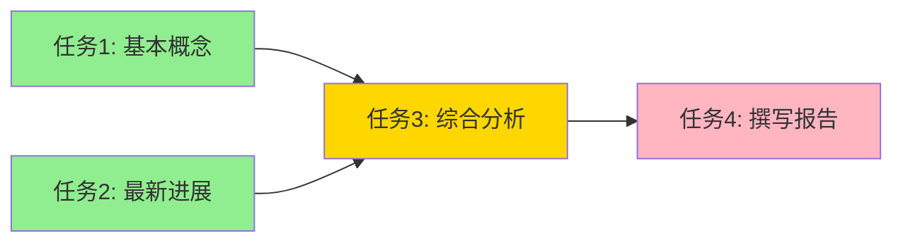

# 多 Agent 高级：大规模编排与动态生成

::: tip 学习目标
- 掌握异步并行调度器的实现，理解基于 DAG 的任务执行引擎
- 学会动态 Agent 生成——根据任务自动创建专业 Agent
- 理解 Agent 社会模拟的设计思路，观察多 Agent 涌现行为

**学完你能做到：** 用异步 Promise 实现真正并行的多 Agent 调度，构建一个 Agent 工厂按需生成 Agent，设计一个多 Agent 辩论-迭代系统。
:::

## 异步并行调度器

进阶篇的 TaskScheduler 是同步执行的——即使两个任务没有依赖关系，也是串行跑。在真实场景中，没有依赖的任务应该并行执行以节省时间。

关键思路：每个任务启动时，先 `await` 等待自己所有的依赖完成，然后才执行。这样有依赖的任务自然会等待，没有依赖的任务自然会并行。

```typescript
import Anthropic from "@anthropic-ai/sdk";

const client = new Anthropic();

enum TaskStatus {
  PENDING = "pending",
  RUNNING = "running",
  COMPLETED = "completed",
  FAILED = "failed",
}

interface SubTask {
  id: number;
  description: string;
  agent: string;
  dependencies: number[];
  priority: string;
  status: TaskStatus;
  result: string;
}

/**
 * 异步任务调度器：支持真正的并行执行
 *
 * 核心思路：所有任务同时启动为 Promise，
 * 每个任务内部 await 自己的依赖完成事件。
 * 无依赖的任务立即执行，有依赖的任务自动等待。
 */
class AsyncTaskScheduler {
  protected tasks: Map<number, SubTask> = new Map();
  // 用 Promise + resolve 函数模拟 asyncio.Event
  protected completedResolvers: Map<number, () => void> = new Map();
  protected completedPromises: Map<number, Promise<void>> = new Map();

  addTasks(
    subtasks: {
      id: number;
      description: string;
      agent: string;
      dependencies?: number[];
      priority?: string;
    }[]
  ): void {
    for (const st of subtasks) {
      const task: SubTask = {
        ...st,
        dependencies: st.dependencies ?? [],
        priority: st.priority ?? "medium",
        status: TaskStatus.PENDING,
        result: "",
      };
      this.tasks.set(task.id, task);
      // 为每个任务创建一个可等待的 Promise
      let resolver: () => void;
      const promise = new Promise<void>((resolve) => {
        resolver = resolve;
      });
      this.completedResolvers.set(task.id, resolver!);
      this.completedPromises.set(task.id, promise);
    }
  }

  /** 异步执行单个任务 */
  async executeTask(task: SubTask): Promise<void> {
    // 等待所有依赖完成
    for (const depId of task.dependencies) {
      const depPromise = this.completedPromises.get(depId);
      if (depPromise) {
        await depPromise;
      }
    }

    task.status = TaskStatus.RUNNING;
    console.log(`[开始] 任务 ${task.id}: ${task.description.slice(0, 40)}...`);

    try {
      // 收集依赖任务的结果
      let depContext = "";
      for (const depId of task.dependencies) {
        const depTask = this.tasks.get(depId);
        if (depTask?.result) {
          depContext += `\n[依赖${depId}]: ${depTask.result.slice(0, 200)}`;
        }
      }

      const response = await client.messages.create({
        model: "claude-sonnet-4-20250514",
        max_tokens: 1024,
        messages: [
          {
            role: "user",
            content: `任务：${task.description}${depContext}`,
          },
        ],
      });
      task.result =
        response.content[0].type === "text" ? response.content[0].text : "";
      task.status = TaskStatus.COMPLETED;
    } catch (e) {
      task.status = TaskStatus.FAILED;
      task.result = String(e);
    }

    // 通知等待此任务完成的其他任务
    this.completedResolvers.get(task.id)?.();
    console.log(`[完成] 任务 ${task.id} (${task.status})`);
  }

  /** 并行执行所有任务（自动处理依赖） */
  async runAll(): Promise<Record<number, string>> {
    const promises = [...this.tasks.values()].map((task) =>
      this.executeTask(task)
    );
    await Promise.all(promises);
    const results: Record<number, string> = {};
    for (const [tid, t] of this.tasks) {
      results[tid] = t.result;
    }
    return results;
  }
}

// 使用示例
async function main() {
  const scheduler = new AsyncTaskScheduler();
  scheduler.addTasks([
    {
      id: 1,
      description: "调研 RAG 基本概念",
      agent: "researcher",
      dependencies: [],
    },
    {
      id: 2,
      description: "调研 RAG 最新进展",
      agent: "researcher",
      dependencies: [],
    },
    {
      id: 3,
      description: "综合分析 RAG 的优缺点",
      agent: "analyst",
      dependencies: [1, 2],
    },
    {
      id: 4,
      description: "撰写技术报告",
      agent: "writer",
      dependencies: [3],
    },
  ]);
  // 任务 1 和 2 并行执行，任务 3 等待 1+2，任务 4 等待 3
  const results = await scheduler.runAll();
  return results;
}

// main();
```



::: warning 并行的代价
并行不是免费的。需要注意：
- **API 速率限制**：5 个任务同时发 API 调用可能触发限流，考虑加并发限制控制并发数
- **错误传播**：一个任务失败了，依赖它的所有下游任务都会受影响
- **状态一致性**：多个并行任务同时读写共享状态需要加锁
:::

### 加入并发控制

```typescript
/**
 * 简易并发限制器，等价于 asyncio.Semaphore
 */
class Semaphore {
  private current = 0;
  private waiting: (() => void)[] = [];

  constructor(private max: number) {}

  async acquire(): Promise<void> {
    if (this.current < this.max) {
      this.current++;
      return;
    }
    return new Promise<void>((resolve) => {
      this.waiting.push(() => {
        this.current++;
        resolve();
      });
    });
  }

  release(): void {
    this.current--;
    if (this.waiting.length > 0) {
      const next = this.waiting.shift()!;
      next();
    }
  }
}

/** 带速率限制的异步调度器 */
class RateLimitedScheduler extends AsyncTaskScheduler {
  private semaphore: Semaphore;

  constructor(maxConcurrent: number = 3) {
    super();
    this.semaphore = new Semaphore(maxConcurrent);
  }

  async executeTask(task: SubTask): Promise<void> {
    // 等待依赖
    for (const depId of task.dependencies) {
      const depPromise = this.completedPromises.get(depId);
      if (depPromise) {
        await depPromise;
      }
    }

    // 通过并发限制器控制最大并发数
    await this.semaphore.acquire();
    task.status = TaskStatus.RUNNING;
    console.log(`[开始] 任务 ${task.id} (并发槽位获取)`);

    try {
      const response = await client.messages.create({
        model: "claude-sonnet-4-20250514",
        max_tokens: 1024,
        messages: [
          {
            role: "user",
            content: `任务：${task.description}`,
          },
        ],
      });
      task.result =
        response.content[0].type === "text" ? response.content[0].text : "";
      task.status = TaskStatus.COMPLETED;
    } catch (e) {
      task.status = TaskStatus.FAILED;
      task.result = String(e);
    } finally {
      this.semaphore.release();
    }

    this.completedResolvers.get(task.id)?.();
  }
}
```

## 动态 Agent 生成

到目前为止，我们的 Agent 都是预先定义好的。但在更复杂的场景中，你不可能提前知道需要哪些 Agent——任务来了，再动态创建合适的 Agent。

### Agent 工厂

```typescript
/** Agent 规格说明 */
interface AgentSpec {
  name: string;
  role: string;
  system_prompt: string;
  tools?: string[];
  temperature?: number;
}

/**
 * Agent 工厂：根据任务动态生成专业 Agent
 *
 * 核心思路：让 LLM 分析任务需求，自动决定需要
 * 创建哪些 Agent、各自的角色和能力。
 */
class AgentFactory {
  private registry: Record<string, AgentSpec> = {};

  /** 分析任务，自动生成所需的 Agent 团队 */
  async analyzeAndCreate(
    task: string,
    maxAgents: number = 4
  ): Promise<AgentSpec[]> {
    const response = await client.messages.create({
      model: "claude-sonnet-4-20250514",
      max_tokens: 1024,
      messages: [
        {
          role: "user",
          content: `分析以下任务，设计一个 Agent 团队来完成它。

任务：${task}

要求：
1. 最多 ${maxAgents} 个 Agent
2. 每个 Agent 有明确的专业分工
3. 避免职责重叠

返回 JSON：
{"agents": [
  {
    "name": "agent_名称",
    "role": "一句话角色描述",
    "system_prompt": "详细的系统提示词",
    "temperature": 0.7
  }
]}`,
        },
      ],
    });

    const text =
      response.content[0].type === "text" ? response.content[0].text : "{}";
    const specs: AgentSpec[] = JSON.parse(text).agents;
    const agents: AgentSpec[] = [];
    for (const spec of specs) {
      this.registry[spec.name] = spec;
      agents.push(spec);
      console.log(`[Factory] 创建 Agent: ${spec.name} (${spec.role})`);
    }

    return agents;
  }

  /** 运行指定的 Agent */
  async runAgent(
    spec: AgentSpec,
    task: string,
    context: string = ""
  ): Promise<string> {
    let prompt = task;
    if (context) {
      prompt = `上下文信息：\n${context}\n\n任务：${task}`;
    }

    const response = await client.messages.create({
      model: "claude-sonnet-4-20250514",
      max_tokens: 2048,
      system: spec.system_prompt,
      temperature: spec.temperature ?? 0.7,
      messages: [{ role: "user", content: prompt }],
    });
    return response.content[0].type === "text" ? response.content[0].text : "";
  }

  /** 自动创建团队并协作完成任务 */
  async runTeam(task: string): Promise<string> {
    // 1. 分析任务，创建 Agent 团队
    const agents = await this.analyzeAndCreate(task);

    // 2. 按顺序执行（简单的 Pipeline 策略）
    let context = "";
    const results: Record<string, string> = {};
    for (const agent of agents) {
      console.log(`\n[Running] ${agent.name}: ${agent.role}`);
      const result = await this.runAgent(agent, task, context);
      results[agent.name] = result;
      // 累积上下文
      context += `\n\n[${agent.name} 的输出]:\n${result.slice(0, 500)}`;
    }

    // 3. 汇总
    const summaryResponse = await client.messages.create({
      model: "claude-sonnet-4-20250514",
      max_tokens: 2048,
      messages: [
        {
          role: "user",
          content:
            `请整合以下团队成员的输出，生成最终结果。\n\n` +
            `原始任务：${task}\n\n` +
            Object.entries(results)
              .map(([name, r]) => `[${name}]: ${r.slice(0, 300)}`)
              .join("\n\n"),
        },
      ],
    });
    return summaryResponse.content[0].type === "text"
      ? summaryResponse.content[0].text
      : "";
  }
}

// 使用示例
const factory = new AgentFactory();
const result = await factory.runTeam(
  "设计一个面向初创公司的 AI 客服系统方案"
);
console.log(result);
```

动态生成的好处是**灵活性**——同一个 AgentFactory 可以处理完全不同类型的任务，每次根据任务需求创建最合适的团队。

## Agent 社会模拟

一个更前沿的方向：让多个 Agent 在一个模拟环境中持续交互，观察涌现行为。这不仅用于学术研究，也可以用于市场策略模拟、用户行为预测等场景。

### 多 Agent 辩论-迭代系统

```typescript
interface AgentDef {
  name: string;
  role: string;
  system_prompt: string;
}

interface RoundEntry {
  name: string;
  role: string;
  statement: string;
  confidence: number;
}

/**
 * 迭代式辩论系统
 *
 * 多个 Agent 不是一次性辩论，而是多轮迭代。
 * 每轮辩论后，Agent 可以修正自己的观点。
 * 我们观察观点是否会趋于收敛。
 */
class IterativeDebateSystem {
  private debateHistory: RoundEntry[][] = [];

  /**
   * @param agents Agent 定义列表，每项包含 name, role, system_prompt
   */
  constructor(private agents: AgentDef[]) {}

  /** 执行一轮辩论 */
  async runRound(topic: string, roundNum: number): Promise<RoundEntry[]> {
    const roundResults: RoundEntry[] = [];

    for (const agent of this.agents) {
      // 构建上下文：上一轮所有人的观点
      let context = "";
      if (this.debateHistory.length > 0) {
        const lastRound = this.debateHistory[this.debateHistory.length - 1];
        context =
          "上一轮各方观点：\n" +
          lastRound
            .filter((r) => r.name !== agent.name)
            .map((r) => `[${r.name}]: ${r.statement.slice(0, 200)}`)
            .join("\n");
      }

      const prompt = `话题：${topic}

${context}

这是第 ${roundNum + 1} 轮讨论。
请从你的角度发表观点。如果看到其他人的观点有道理，可以调整你的立场。
在回答末尾，用 1-10 分标注你对自己观点的确信度。

格式：
观点：...
确信度：X/10`;

      const response = await client.messages.create({
        model: "claude-sonnet-4-20250514",
        max_tokens: 512,
        system: agent.system_prompt,
        messages: [{ role: "user", content: prompt }],
      });

      const text =
        response.content[0].type === "text" ? response.content[0].text : "";
      // 简单提取确信度
      let confidence = 5; // 默认值
      if (text.includes("确信度")) {
        try {
          const confPart = text.split("确信度")[1];
          const nums = confPart.match(/(\d+)/);
          if (nums) {
            confidence = parseInt(nums[0], 10);
          }
        } catch {
          // 保持默认值
        }
      }

      roundResults.push({
        name: agent.name,
        role: agent.role,
        statement: text,
        confidence,
      });
    }

    this.debateHistory.push(roundResults);
    return roundResults;
  }

  /** 执行多轮辩论 */
  async runDebate(
    topic: string,
    rounds: number = 3
  ): Promise<{
    convergence_data: Record<string, number[]>;
    analysis: string;
    total_rounds: number;
  }> {
    console.log(`=== 辩论话题：${topic} ===\n`);

    for (let r = 0; r < rounds; r++) {
      console.log(`--- 第 ${r + 1} 轮 ---`);
      const results = await this.runRound(topic, r);
      for (const result of results) {
        console.log(`[${result.name}] 确信度: ${result.confidence}/10`);
        console.log(`  ${result.statement.slice(0, 100)}...\n`);
      }
    }

    // 分析收敛情况
    return this.analyzeConvergence(topic);
  }

  /** 分析辩论是否趋于收敛 */
  private async analyzeConvergence(topic: string): Promise<{
    convergence_data: Record<string, number[]>;
    analysis: string;
    total_rounds: number;
  }> {
    // 收集所有轮次的确信度变化
    const convergenceData: Record<string, number[]> = {};
    for (const agent of this.agents) {
      const confidences: number[] = [];
      for (const roundData of this.debateHistory) {
        for (const entry of roundData) {
          if (entry.name === agent.name) {
            confidences.push(entry.confidence);
          }
        }
      }
      convergenceData[agent.name] = confidences;
    }

    // 让 LLM 做最终总结
    let allRounds = "";
    for (let i = 0; i < this.debateHistory.length; i++) {
      allRounds += `\n第 ${i + 1} 轮：\n`;
      for (const entry of this.debateHistory[i]) {
        allRounds +=
          `  [${entry.name}] ` +
          `(确信度 ${entry.confidence}/10): ` +
          `${entry.statement.slice(0, 150)}\n`;
      }
    }

    const response = await client.messages.create({
      model: "claude-sonnet-4-20250514",
      max_tokens: 1024,
      messages: [
        {
          role: "user",
          content:
            `分析以下多轮辩论的结果：\n\n` +
            `话题：${topic}\n${allRounds}\n\n` +
            `请分析：1. 各方观点是否趋于收敛 ` +
            `2. 最终的共识点和分歧点 ` +
            `3. 哪些论点最有说服力`,
        },
      ],
    });

    return {
      convergence_data: convergenceData,
      analysis:
        response.content[0].type === "text" ? response.content[0].text : "",
      total_rounds: this.debateHistory.length,
    };
  }
}

// 使用示例
const debateSystem = new IterativeDebateSystem([
  {
    name: "技术专家",
    role: "CTO",
    system_prompt: "你是一位技术专家，关注技术可行性和创新。",
  },
  {
    name: "商业分析师",
    role: "商业策略师",
    system_prompt: "你是商业分析师，关注市场需求和商业价值。",
  },
  {
    name: "风险管理者",
    role: "风险顾问",
    system_prompt: "你是风险管理顾问，关注潜在风险和合规问题。",
  },
]);

const debateResult = await debateSystem.runDebate(
  "创业公司是否应该在产品早期就投入 AI Agent 能力？",
  3
);
console.log("\n=== 最终分析 ===");
console.log(debateResult.analysis);
```

::: tip 涌现行为的观察点
多 Agent 辩论中有几个有趣的现象值得关注：
1. **观点极化**：有时 Agent 会越辩越极端，而非趋于共识
2. **权威效应**：如果一个 Agent 表现得很自信，其他 Agent 可能被"说服"
3. **新信息涌现**：辩论过程中可能产生任何单个 Agent 都无法独立想到的洞察
4. **确信度波动**：观察每轮确信度的变化曲线，可以判断话题的争议程度
:::

## 生产级多 Agent 系统设计要点

当你要把多 Agent 系统推向生产环境时，还需要考虑几个工程问题：

```typescript
// 1. 超时和熔断
async function executeWithTimeout<T>(
  task: { id: number },
  runAgent: () => Promise<T>,
  timeoutMs: number = 30_000
): Promise<T | string> {
  /** 给每个 Agent 执行设置超时 */
  try {
    return await Promise.race([
      runAgent(),
      new Promise<never>((_, reject) =>
        setTimeout(
          () => reject(new Error("timeout")),
          timeoutMs
        )
      ),
    ]);
  } catch (e) {
    if (e instanceof Error && e.message === "timeout") {
      return `任务 ${task.id} 超时（${timeoutMs / 1000}s），跳过`;
    }
    throw e;
  }
}

// 2. 重试机制
async function executeWithRetry<T>(
  task: { id: number },
  runAgent: () => Promise<T>,
  maxRetries: number = 3
): Promise<T | string> {
  /** 失败自动重试 */
  for (let attempt = 0; attempt < maxRetries; attempt++) {
    try {
      return await runAgent();
    } catch (e) {
      if (attempt < maxRetries - 1) {
        const waitTime = 2 ** attempt; // 指数退避
        console.log(`任务 ${task.id} 失败，${waitTime}s 后重试...`);
        await new Promise((r) => setTimeout(r, waitTime * 1000));
      } else {
        return `任务 ${task.id} 在 ${maxRetries} 次重试后仍然失败: ${e}`;
      }
    }
  }
  return "unreachable";
}

// 3. 成本追踪
class CostTracker {
  /** 追踪多 Agent 系统的总成本 */
  private totalInputTokens = 0;
  private totalOutputTokens = 0;
  private callCount = 0;

  record(inputTokens: number, outputTokens: number): void {
    this.totalInputTokens += inputTokens;
    this.totalOutputTokens += outputTokens;
    this.callCount++;
  }

  /** 估算 USD 成本（以 Claude Sonnet 为例） */
  get estimatedCost(): number {
    return (
      (this.totalInputTokens * 3) / 1_000_000 +
      (this.totalOutputTokens * 15) / 1_000_000
    );
  }

  report(): string {
    return (
      `API 调用: ${this.callCount} 次\n` +
      `输入 Token: ${this.totalInputTokens.toLocaleString()}\n` +
      `输出 Token: ${this.totalOutputTokens.toLocaleString()}\n` +
      `估算成本: $${this.estimatedCost.toFixed(4)}`
    );
  }
}
```

## 小结

- 异步调度器用 Promise + resolve 函数实现依赖等待，无依赖任务自然并行
- 并发控制用 Semaphore 限制同时执行的任务数，避免触发 API 限流
- 动态 Agent 生成让系统能适应任意类型的任务，核心是用 LLM 分析任务需求并自动创建团队
- Agent 社会模拟通过多轮迭代辩论观察涌现行为，有实际的决策辅助价值
- 生产环境需要超时、重试、成本追踪等工程保障

## 练习

1. 给 AsyncTaskScheduler 添加重试机制：任务失败后自动重试最多 3 次，用指数退避控制重试间隔。
2. 扩展 AgentFactory：让它不仅能创建 Agent，还能根据任务自动决定使用 Supervisor 还是 Pipeline 策略。
3. 运行一个多 Agent 辩论实验：让 5 个 Agent 就"远程办公 vs 回归办公室"辩论 5 轮，用可视化展示确信度的变化曲线。

## 参考资源

- [Python asyncio Documentation](https://docs.python.org/3/library/asyncio.html) -- Python 异步编程
- [Generative Agents (arXiv:2304.03442)](https://arxiv.org/abs/2304.03442) -- Generative Agents 社会模拟论文
- [Society of Mind (arXiv:2305.17066)](https://arxiv.org/abs/2305.17066) -- "心智社会"多 Agent 协作
- [LangGraph: Plan-and-Execute](https://langchain-ai.github.io/langgraph/tutorials/plan-and-execute/plan-and-execute/) -- LangGraph 任务分解教程
- [AutoGen: Group Chat with Consensus](https://microsoft.github.io/autogen/docs/topics/groupchat/) -- AutoGen 群聊共识
- [DAG-based Task Scheduling](https://en.wikipedia.org/wiki/Directed_acyclic_graph) -- DAG 任务调度基础
