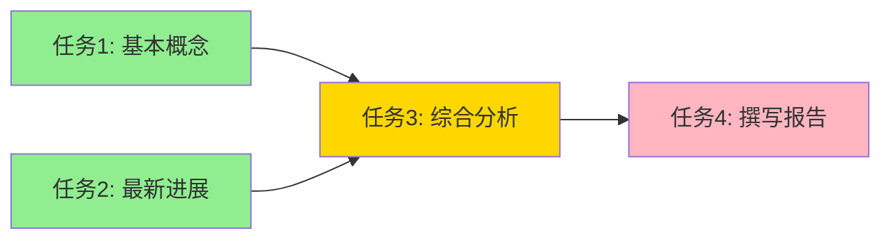

# 多 Agent 高级：大规模编排与动态生成

::: tip 学习目标
- 掌握异步并行调度器的实现，理解基于 DAG 的任务执行引擎
- 学会动态 Agent 生成——根据任务自动创建专业 Agent
- 理解 Agent 社会模拟的设计思路，观察多 Agent 涌现行为

**学完你能做到：** 用 asyncio 实现真正并行的多 Agent 调度，构建一个 Agent 工厂按需生成 Agent，设计一个多 Agent 辩论-迭代系统。
:::

## 异步并行调度器

进阶篇的 TaskScheduler 是同步执行的——即使两个任务没有依赖关系，也是串行跑。在真实场景中，没有依赖的任务应该并行执行以节省时间。

关键思路：每个任务启动时，先 `await` 等待自己所有的依赖完成，然后才执行。这样有依赖的任务自然会等待，没有依赖的任务自然会并行。

```python
import asyncio
from dataclasses import dataclass, field
from enum import Enum
from anthropic import AsyncAnthropic

async_client = AsyncAnthropic()

class TaskStatus(Enum):
    PENDING = "pending"
    RUNNING = "running"
    COMPLETED = "completed"
    FAILED = "failed"

@dataclass
class SubTask:
    id: int
    description: str
    agent: str
    dependencies: list[int] = field(default_factory=list)
    priority: str = "medium"
    status: TaskStatus = TaskStatus.PENDING
    result: str = ""

class AsyncTaskScheduler:
    """异步任务调度器：支持真正的并行执行

    核心思路：所有任务同时启动为 coroutine，
    每个任务内部 await 自己的依赖完成事件。
    无依赖的任务立即执行，有依赖的任务自动等待。
    """

    def __init__(self):
        self.tasks: dict[int, SubTask] = {}
        self.completed_event: dict[int, asyncio.Event] = {}

    def add_tasks(self, subtasks: list[dict]):
        for st in subtasks:
            task = SubTask(**st)
            self.tasks[task.id] = task
            self.completed_event[task.id] = asyncio.Event()

    async def execute_task(self, task: SubTask):
        """异步执行单个任务"""
        # 等待所有依赖完成
        for dep_id in task.dependencies:
            if dep_id in self.completed_event:
                await self.completed_event[dep_id].wait()

        task.status = TaskStatus.RUNNING
        print(f"[开始] 任务 {task.id}: {task.description[:40]}...")

        try:
            # 收集依赖任务的结果
            dep_context = ""
            for dep_id in task.dependencies:
                dep_task = self.tasks.get(dep_id)
                if dep_task and dep_task.result:
                    dep_context += f"\n[依赖{dep_id}]: {dep_task.result[:200]}"

            response = await async_client.messages.create(
                model="claude-sonnet-4-20250514",
                max_tokens=1024,
                messages=[{
                    "role": "user",
                    "content": f"任务：{task.description}{dep_context}"
                }]
            )
            task.result = response.content[0].text
            task.status = TaskStatus.COMPLETED
        except Exception as e:
            task.status = TaskStatus.FAILED
            task.result = str(e)

        # 通知等待此任务完成的其他任务
        self.completed_event[task.id].set()
        print(f"[完成] 任务 {task.id} ({task.status.value})")

    async def run_all(self) -> dict[int, str]:
        """并行执行所有任务（自动处理依赖）"""
        coroutines = [
            self.execute_task(task) for task in self.tasks.values()
        ]
        await asyncio.gather(*coroutines)
        return {tid: t.result for tid, t in self.tasks.items()}


# 使用示例
async def main():
    scheduler = AsyncTaskScheduler()
    scheduler.add_tasks([
        {"id": 1, "description": "调研 RAG 基本概念",
         "agent": "researcher", "dependencies": []},
        {"id": 2, "description": "调研 RAG 最新进展",
         "agent": "researcher", "dependencies": []},
        {"id": 3, "description": "综合分析 RAG 的优缺点",
         "agent": "analyst", "dependencies": [1, 2]},
        {"id": 4, "description": "撰写技术报告",
         "agent": "writer", "dependencies": [3]},
    ])
    # 任务 1 和 2 并行执行，任务 3 等待 1+2，任务 4 等待 3
    results = await scheduler.run_all()
    return results

# asyncio.run(main())
```



::: warning 并行的代价
并行不是免费的。需要注意：
- **API 速率限制**：5 个任务同时发 API 调用可能触发限流，考虑加信号量控制并发数
- **错误传播**：一个任务失败了，依赖它的所有下游任务都会受影响
- **状态一致性**：多个 coroutine 同时读写共享状态需要加锁
:::

### 加入并发控制

```python
class RateLimitedScheduler(AsyncTaskScheduler):
    """带速率限制的异步调度器"""

    def __init__(self, max_concurrent: int = 3):
        super().__init__()
        self.semaphore = asyncio.Semaphore(max_concurrent)

    async def execute_task(self, task: SubTask):
        # 等待依赖
        for dep_id in task.dependencies:
            if dep_id in self.completed_event:
                await self.completed_event[dep_id].wait()

        # 通过信号量控制最大并发数
        async with self.semaphore:
            task.status = TaskStatus.RUNNING
            print(f"[开始] 任务 {task.id} (并发槽位获取)")

            try:
                response = await async_client.messages.create(
                    model="claude-sonnet-4-20250514",
                    max_tokens=1024,
                    messages=[{
                        "role": "user",
                        "content": f"任务：{task.description}"
                    }]
                )
                task.result = response.content[0].text
                task.status = TaskStatus.COMPLETED
            except Exception as e:
                task.status = TaskStatus.FAILED
                task.result = str(e)

        self.completed_event[task.id].set()
```

## 动态 Agent 生成

到目前为止，我们的 Agent 都是预先定义好的。但在更复杂的场景中，你不可能提前知道需要哪些 Agent——任务来了，再动态创建合适的 Agent。

### Agent 工厂

```python
import anthropic

client = anthropic.Anthropic()

@dataclass
class AgentSpec:
    """Agent 规格说明"""
    name: str
    role: str
    system_prompt: str
    tools: list[str] = field(default_factory=list)
    temperature: float = 0.7

class AgentFactory:
    """Agent 工厂：根据任务动态生成专业 Agent

    核心思路：让 LLM 分析任务需求，自动决定需要
    创建哪些 Agent、各自的角色和能力。
    """

    def __init__(self):
        self.registry: dict[str, AgentSpec] = {}

    def analyze_and_create(self, task: str,
                           max_agents: int = 4) -> list[AgentSpec]:
        """分析任务，自动生成所需的 Agent 团队"""
        response = client.messages.create(
            model="claude-sonnet-4-20250514",
            max_tokens=1024,
            messages=[{
                "role": "user",
                "content": f"""分析以下任务，设计一个 Agent 团队来完成它。

任务：{task}

要求：
1. 最多 {max_agents} 个 Agent
2. 每个 Agent 有明确的专业分工
3. 避免职责重叠

返回 JSON：
{{"agents": [
  {{
    "name": "agent_名称",
    "role": "一句话角色描述",
    "system_prompt": "详细的系统提示词",
    "temperature": 0.7
  }}
]}}"""
            }]
        )

        import json
        specs = json.loads(response.content[0].text)["agents"]
        agents = []
        for spec_data in specs:
            spec = AgentSpec(**spec_data)
            self.registry[spec.name] = spec
            agents.append(spec)
            print(f"[Factory] 创建 Agent: {spec.name} ({spec.role})")

        return agents

    def run_agent(self, spec: AgentSpec, task: str,
                  context: str = "") -> str:
        """运行指定的 Agent"""
        prompt = task
        if context:
            prompt = f"上下文信息：\n{context}\n\n任务：{task}"

        response = client.messages.create(
            model="claude-sonnet-4-20250514",
            max_tokens=2048,
            system=spec.system_prompt,
            temperature=spec.temperature,
            messages=[{"role": "user", "content": prompt}]
        )
        return response.content[0].text

    def run_team(self, task: str) -> str:
        """自动创建团队并协作完成任务"""
        # 1. 分析任务，创建 Agent 团队
        agents = self.analyze_and_create(task)

        # 2. 按顺序执行（简单的 Pipeline 策略）
        context = ""
        results = {}
        for agent in agents:
            print(f"\n[Running] {agent.name}: {agent.role}")
            result = self.run_agent(agent, task, context)
            results[agent.name] = result
            # 累积上下文
            context += f"\n\n[{agent.name} 的输出]:\n{result[:500]}"

        # 3. 汇总
        summary_response = client.messages.create(
            model="claude-sonnet-4-20250514",
            max_tokens=2048,
            messages=[{
                "role": "user",
                "content": f"请整合以下团队成员的输出，生成最终结果。\n\n"
                           f"原始任务：{task}\n\n"
                           + "\n\n".join([
                               f"[{name}]: {r[:300]}"
                               for name, r in results.items()
                           ])
            }]
        )
        return summary_response.content[0].text


# 使用示例
factory = AgentFactory()
result = factory.run_team("设计一个面向初创公司的 AI 客服系统方案")
print(result)
```

动态生成的好处是**灵活性**——同一个 AgentFactory 可以处理完全不同类型的任务，每次根据任务需求创建最合适的团队。

## Agent 社会模拟

一个更前沿的方向：让多个 Agent 在一个模拟环境中持续交互，观察涌现行为。这不仅用于学术研究，也可以用于市场策略模拟、用户行为预测等场景。

### 多 Agent 辩论-迭代系统

```python
class IterativeDebateSystem:
    """迭代式辩论系统

    多个 Agent 不是一次性辩论，而是多轮迭代。
    每轮辩论后，Agent 可以修正自己的观点。
    我们观察观点是否会趋于收敛。
    """

    def __init__(self, perspectives: list[dict]):
        """
        Args:
            perspectives: Agent 定义列表，每项包含
                name, role, system_prompt
        """
        self.agents = perspectives
        self.debate_history: list[list[dict]] = []

    def run_round(self, topic: str, round_num: int) -> list[dict]:
        """执行一轮辩论"""
        round_results = []

        for agent in self.agents:
            # 构建上下文：上一轮所有人的观点
            context = ""
            if self.debate_history:
                last_round = self.debate_history[-1]
                context = "上一轮各方观点：\n" + "\n".join([
                    f"[{r['name']}]: {r['statement'][:200]}"
                    for r in last_round if r['name'] != agent['name']
                ])

            prompt = f"""话题：{topic}

{context}

这是第 {round_num + 1} 轮讨论。
请从你的角度发表观点。如果看到其他人的观点有道理，可以调整你的立场。
在回答末尾，用 1-10 分标注你对自己观点的确信度。

格式：
观点：...
确信度：X/10"""

            response = client.messages.create(
                model="claude-sonnet-4-20250514",
                max_tokens=512,
                system=agent["system_prompt"],
                messages=[{"role": "user", "content": prompt}]
            )

            text = response.content[0].text
            # 简单提取确信度
            confidence = 5  # 默认值
            if "确信度" in text:
                try:
                    conf_part = text.split("确信度")[1]
                    import re
                    nums = re.findall(r"(\d+)", conf_part)
                    if nums:
                        confidence = int(nums[0])
                except (IndexError, ValueError):
                    pass

            round_results.append({
                "name": agent["name"],
                "role": agent["role"],
                "statement": text,
                "confidence": confidence,
            })

        self.debate_history.append(round_results)
        return round_results

    def run_debate(self, topic: str, rounds: int = 3) -> dict:
        """执行多轮辩论"""
        print(f"=== 辩论话题：{topic} ===\n")

        for r in range(rounds):
            print(f"--- 第 {r + 1} 轮 ---")
            results = self.run_round(topic, r)
            for result in results:
                print(f"[{result['name']}] 确信度: {result['confidence']}/10")
                print(f"  {result['statement'][:100]}...\n")

        # 分析收敛情况
        return self._analyze_convergence(topic)

    def _analyze_convergence(self, topic: str) -> dict:
        """分析辩论是否趋于收敛"""
        # 收集所有轮次的确信度变化
        convergence_data = {}
        for agent in self.agents:
            name = agent["name"]
            confidences = []
            for round_data in self.debate_history:
                for entry in round_data:
                    if entry["name"] == name:
                        confidences.append(entry["confidence"])
            convergence_data[name] = confidences

        # 让 LLM 做最终总结
        all_rounds = ""
        for i, round_data in enumerate(self.debate_history):
            all_rounds += f"\n第 {i+1} 轮：\n"
            for entry in round_data:
                all_rounds += (f"  [{entry['name']}] "
                              f"(确信度 {entry['confidence']}/10): "
                              f"{entry['statement'][:150]}\n")

        response = client.messages.create(
            model="claude-sonnet-4-20250514",
            max_tokens=1024,
            messages=[{
                "role": "user",
                "content": f"分析以下多轮辩论的结果：\n\n"
                           f"话题：{topic}\n{all_rounds}\n\n"
                           f"请分析：1. 各方观点是否趋于收敛 "
                           f"2. 最终的共识点和分歧点 "
                           f"3. 哪些论点最有说服力"
            }]
        )

        return {
            "convergence_data": convergence_data,
            "analysis": response.content[0].text,
            "total_rounds": len(self.debate_history),
        }


# 使用示例
system = IterativeDebateSystem([
    {
        "name": "技术专家",
        "role": "CTO",
        "system_prompt": "你是一位技术专家，关注技术可行性和创新。",
    },
    {
        "name": "商业分析师",
        "role": "商业策略师",
        "system_prompt": "你是商业分析师，关注市场需求和商业价值。",
    },
    {
        "name": "风险管理者",
        "role": "风险顾问",
        "system_prompt": "你是风险管理顾问，关注潜在风险和合规问题。",
    },
])

result = system.run_debate(
    "创业公司是否应该在产品早期就投入 AI Agent 能力？",
    rounds=3,
)
print("\n=== 最终分析 ===")
print(result["analysis"])
```

::: tip 涌现行为的观察点
多 Agent 辩论中有几个有趣的现象值得关注：
1. **观点极化**：有时 Agent 会越辩越极端，而非趋于共识
2. **权威效应**：如果一个 Agent 表现得很自信，其他 Agent 可能被"说服"
3. **新信息涌现**：辩论过程中可能产生任何单个 Agent 都无法独立想到的洞察
4. **确信度波动**：观察每轮确信度的变化曲线，可以判断话题的争议程度
:::

## 生产级多 Agent 系统设计要点

当你要把多 Agent 系统推向生产环境时，还需要考虑几个工程问题：

```python
# 1. 超时和熔断
async def execute_with_timeout(task, timeout_seconds=30):
    """给每个 Agent 执行设置超时"""
    try:
        return await asyncio.wait_for(
            run_agent(task),
            timeout=timeout_seconds,
        )
    except asyncio.TimeoutError:
        return f"任务 {task.id} 超时（{timeout_seconds}s），跳过"

# 2. 重试机制
async def execute_with_retry(task, max_retries=3):
    """失败自动重试"""
    for attempt in range(max_retries):
        try:
            result = await run_agent(task)
            return result
        except Exception as e:
            if attempt < max_retries - 1:
                wait_time = 2 ** attempt  # 指数退避
                print(f"任务 {task.id} 失败，{wait_time}s 后重试...")
                await asyncio.sleep(wait_time)
            else:
                return f"任务 {task.id} 在 {max_retries} 次重试后仍然失败: {e}"

# 3. 成本追踪
class CostTracker:
    """追踪多 Agent 系统的总成本"""

    def __init__(self):
        self.total_input_tokens = 0
        self.total_output_tokens = 0
        self.call_count = 0

    def record(self, input_tokens: int, output_tokens: int):
        self.total_input_tokens += input_tokens
        self.total_output_tokens += output_tokens
        self.call_count += 1

    @property
    def estimated_cost(self) -> float:
        """估算 USD 成本（以 Claude Sonnet 为例）"""
        return (self.total_input_tokens * 3 / 1_000_000 +
                self.total_output_tokens * 15 / 1_000_000)

    def report(self) -> str:
        return (f"API 调用: {self.call_count} 次\n"
                f"输入 Token: {self.total_input_tokens:,}\n"
                f"输出 Token: {self.total_output_tokens:,}\n"
                f"估算成本: ${self.estimated_cost:.4f}")
```

## 小结

- 异步调度器用 `asyncio.Event` 实现依赖等待，无依赖任务自然并行
- 并发控制用 `asyncio.Semaphore` 限制同时执行的任务数，避免触发 API 限流
- 动态 Agent 生成让系统能适应任意类型的任务，核心是用 LLM 分析任务需求并自动创建团队
- Agent 社会模拟通过多轮迭代辩论观察涌现行为，有实际的决策辅助价值
- 生产环境需要超时、重试、成本追踪等工程保障

## 练习

1. 给 AsyncTaskScheduler 添加重试机制：任务失败后自动重试最多 3 次，用指数退避控制重试间隔。
2. 扩展 AgentFactory：让它不仅能创建 Agent，还能根据任务自动决定使用 Supervisor 还是 Pipeline 策略。
3. 运行一个多 Agent 辩论实验：让 5 个 Agent 就"远程办公 vs 回归办公室"辩论 5 轮，用可视化展示确信度的变化曲线。

## 参考资源

- [Python asyncio Documentation](https://docs.python.org/3/library/asyncio.html) -- Python 异步编程
- [Generative Agents (arXiv:2304.03442)](https://arxiv.org/abs/2304.03442) -- Generative Agents 社会模拟论文
- [Society of Mind (arXiv:2305.17066)](https://arxiv.org/abs/2305.17066) -- "心智社会"多 Agent 协作
- [LangGraph: Plan-and-Execute](https://langchain-ai.github.io/langgraph/tutorials/plan-and-execute/plan-and-execute/) -- LangGraph 任务分解教程
- [AutoGen: Group Chat with Consensus](https://microsoft.github.io/autogen/docs/topics/groupchat/) -- AutoGen 群聊共识
- [DAG-based Task Scheduling](https://en.wikipedia.org/wiki/Directed_acyclic_graph) -- DAG 任务调度基础
