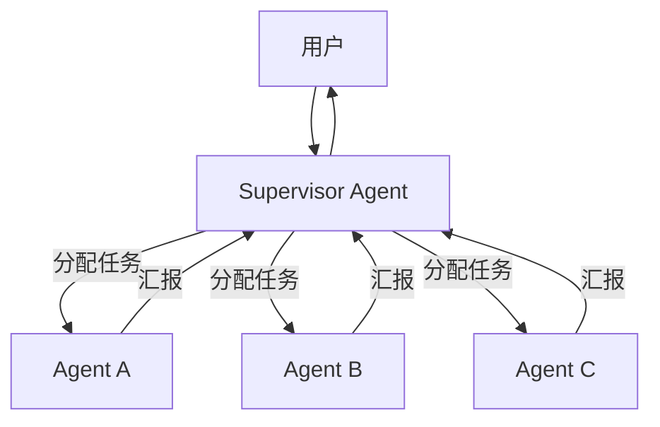
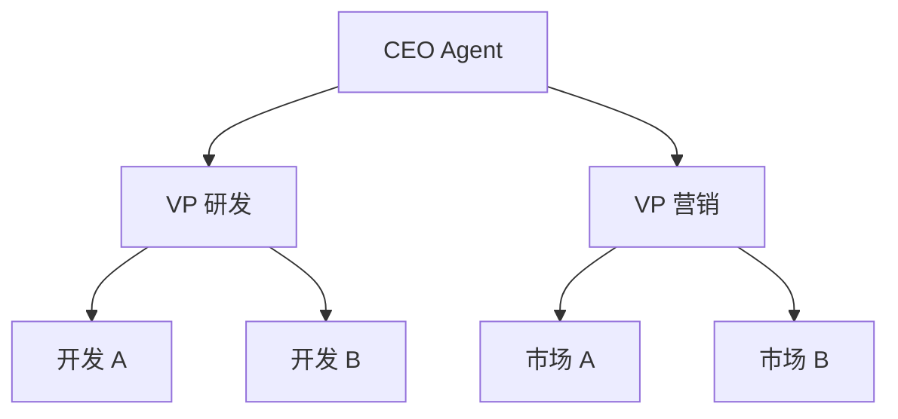

# 多 Agent 入门：架构模式

::: tip 学习目标
- 理解单 Agent 的局限性以及多 Agent 协作的动机
- 掌握五种基本架构模式：Supervisor、Hierarchical、Peer-to-Peer、Debate、Pipeline
- 能够根据实际场景选择合适的多 Agent 架构

**学完你能做到：** 判断某个任务是否需要多 Agent，选择合适的架构模式，并用 Python 实现 Supervisor 和 Pipeline 两种最常用的模式。
:::

## 为什么需要多 Agent

我们先看单个 Agent 在什么情况下会力不从心。

想象你让一个 Agent 完成这样的任务："分析 2024 年 AI Agent 的发展趋势，撰写一份包含数据分析和市场洞察的研究报告。" 这个任务至少涉及三个不同的能力：**信息收集**（大量检索和整理）、**数据分析**（数字解读和趋势提取）、**报告撰写**（结构化表达和逻辑组织）。

单个 Agent 当然可以做，但效果往往不理想——一个 system prompt 很难同时把三个角色都演好。

| 场景 | 单 Agent 的问题 | 多 Agent 的优势 |
|------|----------------|----------------|
| 跨领域任务 | 一个 prompt 难以覆盖所有领域知识 | 各领域专家 Agent 各司其职 |
| 质量保证 | 自己检查自己的盲区 | 独立 Agent 交叉审核 |
| 大规模任务 | 串行处理效率低 | 并行处理加速 |
| 复杂决策 | 单一视角有偏差 | 多视角辩论达成共识 |

::: warning 不要为了"多 Agent"而多 Agent
如果你的任务一个 Agent 就能搞定，加更多 Agent 只会增加延迟和成本。多 Agent 是手段不是目的。判断标准很简单：**任务是否真的需要不同的专业能力或独立的视角？**
:::

## 五种基本架构模式

多 Agent 系统的架构模式决定了 Agent 之间如何分工和协调。我们从最常用的开始讲。

### 1. Supervisor（监督者模式）

一个中央 Supervisor Agent 负责分配任务、监控进度和整合结果。这是最常用的模式，因为它结构清晰，容易理解和调试。



工作流程很直觉：用户提一个大任务 -> Supervisor 拆分成子任务分给各 Worker -> Worker 各自执行 -> Supervisor 整合结果返回用户。

```python
import anthropic
import json

client = anthropic.Anthropic()

class SupervisorSystem:
    """Supervisor 模式实现

    一个中央调度者分配任务给多个专业 Worker，
    最后整合所有 Worker 的输出。
    """

    def __init__(self):
        self.workers = {}

    def add_worker(self, name: str, system_prompt: str):
        """注册一个 Worker Agent"""
        self.workers[name] = system_prompt

    def run(self, task: str) -> str:
        """执行完整的 Supervisor 流程"""
        # 第一步：Supervisor 分析任务并分配
        worker_list = "\n".join([f"- {name}" for name in self.workers])
        response = client.messages.create(
            model="claude-sonnet-4-20250514",
            max_tokens=512,
            messages=[{
                "role": "user",
                "content": f"""作为 Supervisor，分析以下任务并分配给合适的 Worker。

可用 Workers：
{worker_list}

任务：{task}

返回 JSON：{{"assignments": [{{"worker": "名称", "subtask": "子任务描述"}}]}}"""
            }]
        )
        assignments = json.loads(response.content[0].text)["assignments"]

        # 第二步：各 Worker 执行子任务
        results = {}
        for assignment in assignments:
            worker_name = assignment["worker"]
            subtask = assignment["subtask"]
            if worker_name in self.workers:
                result = client.messages.create(
                    model="claude-sonnet-4-20250514",
                    max_tokens=1024,
                    system=self.workers[worker_name],
                    messages=[{"role": "user", "content": subtask}]
                )
                results[worker_name] = result.content[0].text

        # 第三步：Supervisor 整合所有结果
        results_text = "\n\n".join([f"[{k}]: {v}" for k, v in results.items()])
        final = client.messages.create(
            model="claude-sonnet-4-20250514",
            max_tokens=2048,
            messages=[{
                "role": "user",
                "content": f"作为 Supervisor，整合以下 Worker 结果，生成最终报告。\n\n"
                           f"原始任务：{task}\n\nWorker 结果：\n{results_text}"
            }]
        )
        return final.content[0].text


# 使用示例
system = SupervisorSystem()
system.add_worker("researcher", "你是技术研究员，擅长收集和整理信息。")
system.add_worker("analyst", "你是数据分析师，擅长从数据中提取趋势和洞察。")
system.add_worker("writer", "你是技术写作者，擅长将复杂信息转化为清晰的报告。")

result = system.run("分析 2024 年 AI Agent 的发展趋势")
print(result)
```

::: info Supervisor 的优缺点
**优点**：结构清晰，分工明确，容易调试（出问题知道是哪个 Worker）。
**缺点**：Supervisor 是瓶颈——如果它理解错了任务，所有 Worker 都会跑偏。另外 Worker 之间不直接通信，限制了协作的灵活性。
:::

### 2. Hierarchical（层级式）

多层级的管理结构，上层管理下层。适合大型、分层明确的任务。



你可以把它理解为"Supervisor 的 Supervisor"。CEO 分配给 VP，VP 再分配给具体执行者。适合组织模拟、大型项目管理等场景。

### 3. Peer-to-Peer（对等式）

没有中央控制，Agent 之间直接通信和协作。就像一场头脑风暴——每个人都可以发言，没有明确的主持人。

这种模式灵活性最高，但也最难控制。适合需要平等协商、创意碰撞的场景。

### 4. Debate（辩论式）

多个 Agent 对同一问题给出不同观点，通过多轮辩论达成共识，最后由一个裁判总结。

```python
class DebateSystem:
    """辩论式多 Agent 系统

    让不同立场的 Agent 对同一问题展开辩论，
    最后由裁判综合各方观点给出结论。
    """

    def debate(self, question: str, perspectives: list[str],
               rounds: int = 2) -> str:
        agents = []
        for p in perspectives:
            agents.append({
                "perspective": p,
                "history": [],
            })

        # 多轮辩论
        for round_num in range(rounds):
            for agent in agents:
                # 收集其他人的观点作为上下文
                other_views = "\n".join([
                    f"[{a['perspective']}]: {a['history'][-1]}"
                    for a in agents if a is not agent and a["history"]
                ])

                prompt = f"""你代表 "{agent['perspective']}" 的立场。

问题：{question}
{"其他参与者的观点：" + other_views if other_views else "请先发表你的观点。"}

第 {round_num + 1} 轮：请发表你的论点。如果有其他观点，请回应。"""

                response = client.messages.create(
                    model="claude-sonnet-4-20250514",
                    max_tokens=512,
                    messages=[{"role": "user", "content": prompt}]
                )
                agent["history"].append(response.content[0].text)

        # 裁判总结
        all_arguments = "\n\n".join([
            f"=== {a['perspective']} ===\n" + "\n---\n".join(a["history"])
            for a in agents
        ])

        summary = client.messages.create(
            model="claude-sonnet-4-20250514",
            max_tokens=1024,
            messages=[{
                "role": "user",
                "content": f"作为中立裁判，总结辩论并给出综合结论。\n\n"
                           f"问题：{question}\n\n辩论记录：\n{all_arguments}"
            }]
        )
        return summary.content[0].text


# 使用示例
debate = DebateSystem()
result = debate.debate(
    question="AI Agent 应该有多大程度的自主权？",
    perspectives=["技术乐观主义者", "安全研究员", "伦理学家"],
    rounds=2,
)
print(result)
```

Debate 模式特别适合需要多角度审视的决策问题——技术方案选型、风险评估、政策制定等。

### 5. Pipeline（流水线式）

Agent 按固定顺序处理，每个 Agent 的输出是下一个的输入。就像工厂的流水线。

```python
class PipelineSystem:
    """流水线式多 Agent

    每个 Agent 处理完毕后，将结果传给下一个 Agent，
    像流水线一样逐步加工。
    """

    def __init__(self):
        self.stages: list[dict] = []

    def add_stage(self, name: str, system_prompt: str):
        """添加一个流水线阶段"""
        self.stages.append({"name": name, "prompt": system_prompt})

    def run(self, input_text: str) -> str:
        """执行整个流水线"""
        current = input_text
        for stage in self.stages:
            response = client.messages.create(
                model="claude-sonnet-4-20250514",
                max_tokens=2048,
                system=stage["prompt"],
                messages=[{"role": "user", "content": current}]
            )
            current = response.content[0].text
            print(f"[{stage['name']}] 处理完成")
        return current


# 使用示例：需求 -> 架构 -> 实现 -> 评审
pipeline = PipelineSystem()
pipeline.add_stage("需求分析", "你是需求分析师，提取核心需求并输出结构化需求文档。")
pipeline.add_stage("架构设计", "你是架构师，基于需求设计系统架构。")
pipeline.add_stage("实现方案", "你是开发者，基于架构输出详细的实现方案。")
pipeline.add_stage("评审", "你是 Tech Lead，审核方案并提出改进建议。")

result = pipeline.run("开发一个支持多轮对话的客服机器人")
print(result)
```

Pipeline 是最简单的多 Agent 模式，但也有明显限制：流程固定，不能根据中间结果动态调整。

## 各模式适用场景对比

| 模式 | 最佳场景 | 不适合场景 | 复杂度 |
|------|---------|-----------|--------|
| Supervisor | 任务可明确分解 | 需要实时协商 | 低 |
| Hierarchical | 大型组织模拟 | 简单任务 | 中 |
| Peer-to-Peer | 平等协商、头脑风暴 | 需要明确指挥链 | 高 |
| Debate | 决策分析、多视角审视 | 执行性任务 | 中 |
| Pipeline | 流程固定的处理链 | 需要动态调整流程 | 低 |

::: tip 实际项目中的选择建议
- **入门项目**：先用 Pipeline 或 Supervisor，它们结构最清晰
- **需要多角度审核**：加一层 Debate
- **大型系统**：Hierarchical，或者混合多种模式
- **不确定选哪个**：从 Supervisor 开始，够用就别换
:::

## 小结

- 多 Agent 适合跨领域、需要多视角或大规模的任务，但不要为了多 Agent 而多 Agent
- Supervisor 是最常用的入门模式，结构清晰，分工明确
- Pipeline 最简单，适合流程固定的场景
- Debate 模式适合需要多角度分析的决策问题
- 选择模式时要考虑通信开销和协调复杂度

## 练习

1. 用 Supervisor 模式实现一个"产品发布"团队：研发、测试、市场三个 Worker Agent，协作完成一个产品发布方案。
2. 实现 Debate 模式：让"乐观者"和"悲观者"辩论一个技术方案的可行性，观察多轮辩论后结论的变化。
3. 设计一个混合架构：Pipeline + Supervisor，在某个流水线阶段引入多 Agent 协作（比如"评审"阶段由 3 个 Reviewer 投票）。

## 参考资源

- [LangGraph: Multi-Agent Architectures](https://langchain-ai.github.io/langgraph/concepts/multi_agent/) -- LangGraph 多 Agent 架构文档
- [AutoGen: Multi-Agent Conversation Framework](https://microsoft.github.io/autogen/) -- Microsoft 的多 Agent 框架
- [Multi-Agent Debate (arXiv:2305.14325)](https://arxiv.org/abs/2305.14325) -- 多 Agent 辩论论文
- [Communicative Agents for Software Development (arXiv:2307.07924)](https://arxiv.org/abs/2307.07924) -- ChatDev 论文
- [MetaGPT (arXiv:2308.00352)](https://arxiv.org/abs/2308.00352) -- MetaGPT 多 Agent 论文
- [Andrew Ng: Multi-Agent Systems (YouTube)](https://www.youtube.com/watch?v=sal78ACtGTc) -- Andrew Ng 讲解多 Agent
