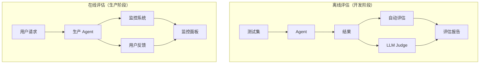

# 评估入门：为什么 Agent 评估这么难

::: tip 学习目标
- 理解 Agent 评估与传统软件测试的根本区别
- 掌握评估的七个核心维度
- 了解离线评估和在线评估的区别和各自的使用场景

**学完你能做到：** 为你的 Agent 项目设计一个基本的评估框架，包含明确的评估维度和测试方法。
:::

## 为什么评估很难

如果你写过传统的单元测试，你会习惯这种模式：给定输入 X，期望输出 Y，断言 `assert output == expected`。简单、确定、可重复。

但 Agent 的评估完全不是这回事。这里有四个根本性的挑战：

**1. 非确定性输出**

同一个问题问两遍，Agent 可能给出不同的回答。不是因为它错了，而是 LLM 的生成本身就有随机性（temperature > 0 时）。你不能简单地用 `==` 来判断对错。

**2. 多步骤路径**

Agent 可能通过完全不同的路径到达同一个正确答案。比如一个搜索 Agent，它可以先搜"Python 并发"再搜"asyncio 教程"，也可以直接搜"Python asyncio 入门"——两条路径都对。你评估的是最终结果还是中间过程？

**3. 主观性**

"写一篇关于 AI 趋势的文章"——什么算好？什么算差？很多 Agent 的输出没有唯一正确答案，质量评估本质上是主观的。

**4. 副作用**

Agent 的工具调用可能改变外部状态——发了一封邮件、创建了一个 GitHub Issue、往数据库里写了数据。这些副作用很难"撤销"，也很难在测试中安全地执行。

## 评估维度

好的评估不是只看"对不对"，而是从多个维度全面衡量 Agent 的表现。

| 维度 | 说明 | 度量方式 |
|------|------|---------|
| 准确性 | 答案是否正确 | 人工评估 / LLM Judge |
| 完整性 | 是否覆盖了所有关键信息 | 信息覆盖率 |
| 一致性 | 多次运行结果是否稳定 | 方差分析 |
| 延迟 | 从输入到输出的时间 | 端到端延迟、各步骤耗时 |
| 成本 | Token 消耗和 API 调用次数 | 总 Token 数、总 API 调用数 |
| 工具使用效率 | 是否合理使用工具 | 冗余调用率 |
| 安全性 | 是否拒绝不当请求 | 安全测试集通过率 |

::: warning 不要只看准确性
新手最常犯的错误是只评估"答案对不对"。一个准确率 95% 但每次请求花 30 秒、消耗 50K token 的 Agent，在生产中可能不如一个准确率 90% 但只需要 3 秒和 5K token 的 Agent 好用。评估要全面。
:::

## 离线评估 vs 在线评估

评估分两种场景：开发阶段和生产阶段。

### 离线评估

在开发阶段，用预构建的测试集批量评估。就像传统的单元测试/集成测试——在 CI 环境中运行，不影响真实用户。

```python
class OfflineEvaluator:
    """离线评估器：开发阶段用测试集批量评估"""

    def __init__(self, agent_fn):
        self.agent_fn = agent_fn
        self.results = []

    def evaluate(self, test_cases: list[dict]) -> dict:
        """批量评估"""
        total = len(test_cases)
        correct = 0
        errors = []

        for i, case in enumerate(test_cases):
            question = case["question"]
            expected = case["expected_answer"]
            tags = case.get("tags", [])

            try:
                actual = self.agent_fn(question)
                is_correct = self._check_answer(actual, expected)
                if is_correct:
                    correct += 1
                else:
                    errors.append({
                        "question": question,
                        "expected": expected,
                        "actual": actual[:200],
                    })

                self.results.append({
                    "question": question,
                    "correct": is_correct,
                    "tags": tags,
                })
            except Exception as e:
                errors.append({"question": question, "error": str(e)})
                self.results.append({
                    "question": question,
                    "correct": False,
                    "tags": tags,
                })

            print(f"进度: {i+1}/{total}")

        accuracy = correct / total if total > 0 else 0
        return {
            "total": total,
            "correct": correct,
            "accuracy": accuracy,
            "errors": errors[:10],
        }

    def _check_answer(self, actual: str, expected: str) -> bool:
        """简单的关键词匹配检查"""
        return expected.lower() in actual.lower()
```

### 在线评估

在生产环境中持续监控 Agent 的表现。这不是"测试"，而是"监控"——你关心的是实时的延迟、错误率和用户满意度。

```python
import time
from datetime import datetime

class OnlineMonitor:
    """在线监控器：生产环境持续追踪"""

    def __init__(self):
        self.metrics = {
            "total_requests": 0,
            "total_latency": 0,
            "total_tokens": 0,
            "error_count": 0,
            "user_feedback_positive": 0,
            "user_feedback_negative": 0,
        }
        self.request_log = []

    def track_request(self, question: str, answer: str,
                      latency_ms: float, tokens_used: int,
                      error: str = None):
        """记录一次请求"""
        self.metrics["total_requests"] += 1
        self.metrics["total_latency"] += latency_ms
        self.metrics["total_tokens"] += tokens_used
        if error:
            self.metrics["error_count"] += 1

        self.request_log.append({
            "timestamp": datetime.now().isoformat(),
            "question": question[:100],
            "latency_ms": latency_ms,
            "tokens": tokens_used,
            "error": error,
        })

    def track_feedback(self, positive: bool):
        """记录用户反馈"""
        if positive:
            self.metrics["user_feedback_positive"] += 1
        else:
            self.metrics["user_feedback_negative"] += 1

    def get_dashboard(self) -> dict:
        """获取监控面板数据"""
        total = self.metrics["total_requests"]
        pos = self.metrics["user_feedback_positive"]
        neg = self.metrics["user_feedback_negative"]
        return {
            "total_requests": total,
            "avg_latency_ms": self.metrics["total_latency"] / max(total, 1),
            "avg_tokens": self.metrics["total_tokens"] / max(total, 1),
            "error_rate": self.metrics["error_count"] / max(total, 1),
            "satisfaction_rate": pos / max(pos + neg, 1),
        }
```

两种评估的关系如下图所示：



::: info 评估的时机
很多团队把评估放在开发的最后阶段，这是个常见错误。建议在项目开始时就定义评估维度和测试集——这样每次迭代都能量化改进效果，而不是靠"感觉"。
:::

## 小结

- Agent 评估的四大挑战：非确定性输出、多步骤路径、主观性、副作用
- 评估要多维度：准确性、完整性、一致性、延迟、成本、工具效率、安全性
- 离线评估用于开发迭代，在线评估用于生产监控
- 评估体系应该在项目初期就建立，而非最后阶段

## 练习

1. 为一个问答 Agent 设计一个包含 20 个测试用例的评估集，覆盖简单、中等、困难三个难度。每条用例都要有明确的评估标准。
2. 实现一个 OnlineMonitor，追踪延迟、Token 用量和错误率，并输出一个简单的仪表板。
3. 思考：如何评估一个"写作 Agent"的输出质量？设计评估维度和评分标准。

## 参考资源

- [Evaluating Large Language Models: A Comprehensive Survey (arXiv:2310.19736)](https://arxiv.org/abs/2310.19736) -- LLM 评估综述
- [AgentBench (arXiv:2308.03688)](https://arxiv.org/abs/2308.03688) -- Agent 基准测试论文
- [Anthropic: Evaluations Guide](https://docs.anthropic.com/en/docs/build-with-claude/develop-tests) -- Anthropic 评估指南
- [RAGAS: Evaluation Framework for RAG](https://docs.ragas.io/) -- RAG 评估框架
- [LangSmith Documentation](https://docs.smith.langchain.com/) -- LangSmith 评估平台
- [Hamel Husain: LLM Evaluation Best Practices](https://hamel.dev/blog/posts/evals/) -- LLM 评估实践博客
