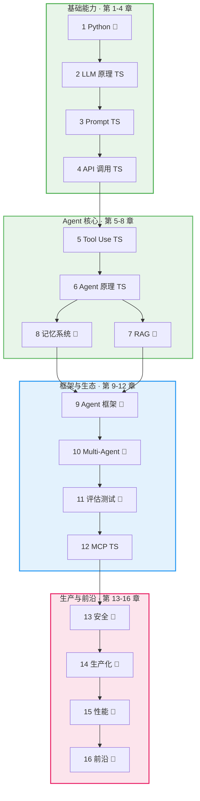

# 本书导读

## 这本手册能帮你什么

如果你是一个前端工程师，想系统地学会 Agent 开发，但不知道从哪里下手——这本手册就是为你写的。

**你不需要 AI 背景，不需要懂数学公式，只要有基本的编程经验就够了。**

这本手册会像一个有经验的师兄一样，带你一步步走完从"完全不懂"到"能独立开发生产级 Agent"的全过程。每个知识点我都会：

- **先用大白话讲清楚"这是什么、为什么需要它"**
- **再给你一段能直接跑的代码**
- **最后告诉你实际工作中怎么用**

不搞学术黑话，不堆砌论文。当然，如果你想深入研究，每章末尾都有推荐的论文和文档链接。

## 适合谁读

你可能是这样的：

- 写了几年前端，熟悉 JS/TS，想用最熟悉的语言切入 Agent 开发
- 天天用 ChatGPT / Claude，但从没调过它们的 API
- 听同事聊 Agent、RAG、MCP，一头雾水但又很想学
- 想转型做 AI 方向，但不知道该学什么、学到什么程度

如果你完全没有编程基础，建议先学基础编程再来。但只要你写过代码（JS/TS/Python 均可）、理解函数和 API 调用，就足够开始了。

## 全书结构

本书共 **16 个知识章节** + **6 个实战项目** + **附录**。

每个章节都分为**初级/中级/高级**三个深度层级。推荐的学习方式是**按深度横着读**：先读完所有章节的初级部分，再读中级，最后读高级。

```
         第1章  第2章  第3章  ···  第14章  第15章  第16章
         Python LLM   Prompt      生产    性能    前沿
┌──────┐
│ 初级 │  ━━━━━━━━━━━━━━━━━━━━━━━━━━━━━━━━━━━━━━━━━━━━  → 先横着读完
├──────┤
│ 中级 │  ━━━━━━━━━━━━━━━━━━━━━━━━━━━━━━━━━━━━━━━━━━━━  → 再横着读完
├──────┤
│ 高级 │  ━━━━━━━━━━━━━━━━━━━━━━━━━━━━━━━━━━━━━━━━━━━━  → 最后横着读完
└──────┘
```

**三种学习路径：**

| 路径 | 读什么 | 能做什么 |
|------|--------|---------|
| 入门 Agent | 所有章节的**初级部分** | 调 API、用工具、写简单 Agent |
| 胜任开发 | 所有章节的**初级+中级** | 用框架搭 RAG、Multi-Agent 系统 |
| 高级工程师 | 全部三个层级 | 生产部署、调优、自建框架 |

## 章节知识主题

16 个章节覆盖 Agent 开发的完整知识体系：



> **TS** = TypeScript，**🐍** = Python。详见下方[语言选择](#语言选择)。

每个章节都有初级/中级/高级三个深度。推荐先横着读完所有初级，再进入中级，最后攻克高级。详见 [学习路线图](/roadmap)。

::: tip 阅读建议
- **推荐方式**：横着读——先读完 16 章的初级，建立全貌；再读中级深入实践；最后高级篇精通
- **跳读**：如果你已有 API 调用基础，初级篇中相应章节可以快速扫过；第 1 章 Python 基础可以等用到框架时再看
- **查阅**：每章相对独立，也可以作为工作中的参考手册按需查阅
:::

## 学习节奏建议

| 阶段 | 读什么 | 建议时间 | 核心产出 |
|------|--------|---------|---------|
| 🟢 初级篇 | 16 章的**初级**部分 | 4 周 | 全面概念地图 + 完成 P1、P2 项目 |
| 🔵 中级篇 | 16 章的**中级**部分 | 4 周 | 工程实践能力 + 完成 P3、P4 项目 |
| 🔴 高级篇 | 16 章的**高级**部分 | 4 周 | 架构设计能力 + 完成 P5、P6 项目 |

## 语言选择

本书采用 **TypeScript 优先 + Python 补充** 的双语策略：

| 章节 | 语言 | 理由 |
|------|------|------|
| 第 2-6 章 | **TypeScript** | API 调用、Tool Use、Agent 核心——用你最熟悉的语言快速上手 |
| 第 7-11 章 | Python | RAG、记忆、框架、Multi-Agent、评估——生态以 Python 为主 |
| 第 12 章 | **TypeScript** | MCP 协议——TS SDK 是一等公民，前端场景更多 |
| 第 13-16 章 | Python | 安全、生产化、性能、前沿——沿用框架生态语言 |

::: tip 为什么不全用一种语言？
Agent 开发的现实是：**概念理解不挑语言，但框架生态选语言**。LangChain/LangGraph/CrewAI 只有 Python SDK，所以框架章节用 Python；而 API 调用和 MCP 开发，TypeScript 体验同样好甚至更好。两种语言都掌握，求职和实战都更灵活。
:::

## 环境准备

在开始阅读之前，请准备以下环境：

### 必需

| 工具 | 版本 | 用途 |
|------|------|------|
| Node.js | 18+ | 主要开发环境（TypeScript 章节） |
| Python | 3.11+ | 框架章节（RAG、LangGraph 等） |
| uv | 最新 | Python 包管理器（替代 pip） |
| Git | 最新 | 版本控制 |
| VS Code | 最新 | 代码编辑器 |

### API Key（按需获取）

| 服务 | 用途 | 获取方式 |
|------|------|---------|
| Anthropic API | Claude 模型调用 | [console.anthropic.com](https://console.anthropic.com/) |
| OpenAI API | GPT 模型调用 | [platform.openai.com](https://platform.openai.com/) |

::: info 关于费用
大部分 API 提供免费额度，足够完成本书的学习练习。初级篇的学习成本预计在 $5 以内。
:::

### 快速安装

```bash
# TypeScript 环境（第 2-6、12 章）
mkdir agent-learning && cd agent-learning
npm init -y
npm install @anthropic-ai/sdk openai
npm install -D typescript tsx @types/node
npx tsx -e "console.log('TypeScript Ready!')"

# Python 环境（第 7-11、13-16 章）
curl -LsSf https://astral.sh/uv/install.sh | sh
uv init python-agents && cd python-agents
uv add anthropic openai httpx
uv run python -c "import anthropic; print('Python Ready!')"
```

## 本书约定

### 代码标注

```typescript
// ✅ 推荐写法
async function fetchData() {
    // ...
}

// ❌ 不推荐写法
function fetchData() {  // 同步写法在 Agent 中会阻塞
    // ...
}
```

### 提示框

::: tip 💡 技巧
实用的开发技巧和经验总结
:::

::: warning ⚠️ 注意
容易踩的坑和需要特别注意的地方
:::

::: danger 🚫 禁止
安全风险或严重错误，必须避免
:::

::: info 📖 延伸阅读
推荐的论文、文档和博客链接
:::

## 开始阅读

准备好了吗？让我们从 [第 2 章 · LLM 原理（初级）](/02-llm-fundamentals/beginner) 开始。

如果你对 Python 不熟悉也没关系——第 2-6 章和第 12 章使用 TypeScript，第 1 章会帮你快速了解 Python 基础，为后续框架章节做准备。
