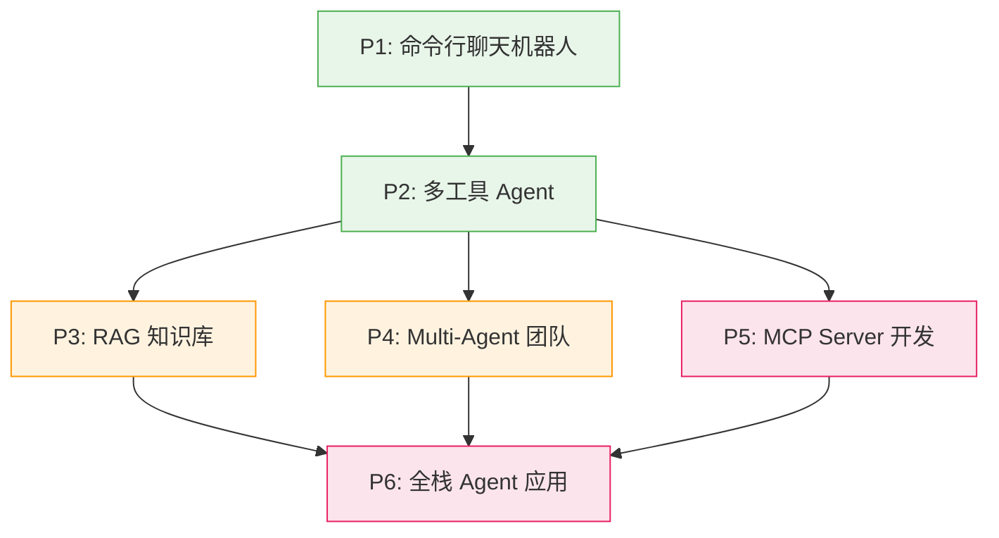

# 实战项目：从零到生产的 6 个递进式项目

::: tip 学习目标
通过 6 个精心设计的实战项目，将前面所学的知识串联起来，构建完整的 Agent 开发能力。每个项目都包含完整的需求分析、架构设计、源码实现和测试方案。
:::

## 本部分的定位

前 16 个章节分别教你各个知识主题的初/中/高三个层级。而项目实战部分，是让你**真正把知识串起来搭出一座房子**。

这里不再是孤立的知识点演练，而是完整的、可交付的项目开发。你将面对真实开发中的决策：如何选型、如何组织代码、如何处理边界情况、如何测试和部署。

## 6 个项目的递进关系



| 项目 | 难度 | 代码量 | 核心挑战 | 对应章节 |
|------|------|--------|---------|---------|
| P1: 命令行聊天机器人 | 🟢 入门 | ~200 行 | API 调用和消息管理 | 第 1-4 章初级 |
| P2: 多工具 Agent | 🟢 初级 | ~300 行 | 手写 Agent 循环 | 第 5-6 章初级 |
| P3: RAG 知识库 | 🟡 中级 | ~500 行 | 文档处理、向量检索 | 第 7-8 章中级 |
| P4: Multi-Agent 团队 | 🟡 中级 | ~600 行 | 多 Agent 协作 | 第 9-10 章中级 |
| P5: MCP Server 开发 | 🔴 中高级 | ~400 行 | 协议实现、生态集成 | 第 12 章中级 |
| P6: 全栈 Agent 应用 | 🔴 高级 | ~2000 行 | 前后端分离、部署 | 第 13-16 章高级 |

## 建议的实战顺序

### 路线一：按顺序逐个完成（推荐新手）

```
各章初级 → P1 → P2 → 各章中级 → P3 → P4 → P5 → 各章高级 → P6
```

### 路线二：目标驱动

| 你的目标 | 直达项目 | 前置项目 |
|---------|---------|---------|
| 想做 AI 聊天产品 | P6 | P1 → P2 |
| 想做知识库问答 | P3 | P1 → P2 |
| 想开发 MCP 插件 | P5 | P2 |
| 想做多 Agent 系统 | P4 | P2 |

## 通用开发环境

```bash
mkdir agent-projects && cd agent-projects
uv init
uv add anthropic httpx rich python-dotenv
echo "ANTHROPIC_API_KEY=your-key-here" > .env
```

::: warning 关于 API 费用
6 个项目全部完成，API 费用预计在 $10-20 之间（使用 Claude Sonnet）。建议在开发和调试阶段使用 Claude Haiku 以降低成本。
:::

## 项目导航

| 项目 | 一句话描述 | 链接 |
|------|-----------|------|
| P1 | 带角色切换和历史管理的终端聊天机器人 | [开始 P1 →](./p1-cli-chatbot/) |
| P2 | 不依赖框架、纯手写的多工具 Agent | [开始 P2 →](./p2-tool-agent/) |
| P3 | 支持多格式文档导入的 RAG 问答系统 | [开始 P3 →](./p3-rag-knowledge/) |
| P4 | 基于 LangGraph 的多 Agent 协作写作团队 | [开始 P4 →](./p4-multi-agent/) |
| P5 | 可发布到 MCP 生态的 GitHub Issues Server | [开始 P5 →](./p5-mcp-server/) |
| P6 | 前后端分离的全栈 Agent 应用（毕业项目） | [开始 P6 →](./p6-full-stack-agent/) |

## 参考资源

- [Anthropic Cookbook](https://github.com/anthropics/anthropic-cookbook) -- 官方代码示例和最佳实践
- [LangChain Templates](https://github.com/langchain-ai/langchain/tree/master/templates) -- LangChain 官方项目模板
- [Build with Claude](https://docs.anthropic.com/en/docs/build-with-claude) -- Anthropic 官方构建指南
