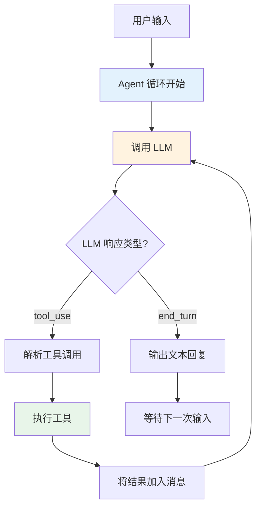

# P2: 多工具 Agent

::: info 项目信息
**难度**: 初级 | **代码量**: ~300 行 | **预计时间**: 4-6 小时
**对应章节**: 初级篇第 5-6 章（Tool Use、Agent 核心原理）
:::

## 项目目标

构建一个**不使用任何框架**的多工具 Agent，纯手写 Agent 循环。这个项目的核心目标不是"能用"，而是**彻底理解 Agent 的运行机制**——LLM 如何决定使用工具、工具结果如何反馈、Agent 何时停止。

### 功能清单

- [x] 5 个实用工具：网页搜索、数学计算、文件读写、天气查询、系统信息
- [x] 纯手写 Agent 循环（ReAct 模式）
- [x] 自动多步推理（一个问题可能需要多次工具调用）
- [x] 完善的错误处理和安全限制
- [x] 多轮对话支持
- [x] 工具调用日志

## 技术选型

| 组件 | 选择 | 理由 |
|------|------|------|
| LLM SDK | `anthropic` | 原生支持 Tool Use |
| HTTP 请求 | `httpx` | 现代 Python HTTP 客户端 |
| 计算引擎 | Python `ast` | 安全的数学表达式计算 |
| 终端输出 | `rich` | 美化工具调用过程展示 |

::: warning 为什么不用框架
本项目故意不使用 LangChain、LangGraph 等框架。只有亲手实现 Agent 循环，你才能真正理解框架在做什么。P4 项目会使用 LangGraph，届时你会感受到框架的价值。
:::

## 架构设计



核心机制：**LLM 返回 `stop_reason: "tool_use"` 时继续循环，返回 `"end_turn"` 时停止。** 这就是 Agent 循环的本质。

## 工具定义

### 工具 Schema

Anthropic Tool Use 要求用 JSON Schema 定义工具参数：

```python
# tools.py - 工具定义（Schema 部分）
TOOLS = [
    {
        "name": "web_search",
        "description": "搜索互联网获取最新信息。当需要查找实时数据、新闻、或你不确定的事实时使用。",
        "input_schema": {
            "type": "object",
            "properties": {
                "query": {
                    "type": "string",
                    "description": "搜索关键词",
                }
            },
            "required": ["query"],
        },
    },
    {
        "name": "calculator",
        "description": "执行数学计算。支持加减乘除、幂运算、三角函数等。输入数学表达式字符串。",
        "input_schema": {
            "type": "object",
            "properties": {
                "expression": {
                    "type": "string",
                    "description": "数学表达式，如 '2**10 + 3*5' 或 'math.sqrt(144)'",
                }
            },
            "required": ["expression"],
        },
    },
    {
        "name": "read_file",
        "description": "读取指定路径的文件内容。仅限当前工作目录下的文件。",
        "input_schema": {
            "type": "object",
            "properties": {
                "path": {
                    "type": "string",
                    "description": "文件路径（相对于工作目录）",
                }
            },
            "required": ["path"],
        },
    },
    {
        "name": "write_file",
        "description": "将内容写入指定路径的文件。仅限当前工作目录下的文件。",
        "input_schema": {
            "type": "object",
            "properties": {
                "path": {
                    "type": "string",
                    "description": "文件路径（相对于工作目录）",
                },
                "content": {
                    "type": "string",
                    "description": "要写入的内容",
                },
            },
            "required": ["path", "content"],
        },
    },
    {
        "name": "get_weather",
        "description": "查询指定城市的当前天气信息。",
        "input_schema": {
            "type": "object",
            "properties": {
                "city": {
                    "type": "string",
                    "description": "城市名称，如 '北京' 或 'Tokyo'",
                }
            },
            "required": ["city"],
        },
    },
]
```

### 工具实现

```python
# tools.py - 工具实现
import ast
import math
import operator
from pathlib import Path

import httpx

# 安全的数学运算符白名单
SAFE_OPERATORS = {
    ast.Add: operator.add,
    ast.Sub: operator.sub,
    ast.Mult: operator.mul,
    ast.Div: operator.truediv,
    ast.Pow: operator.pow,
    ast.USub: operator.neg,
    ast.Mod: operator.mod,
}

# 允许的数学函数
SAFE_FUNCTIONS = {
    "sqrt": math.sqrt,
    "sin": math.sin,
    "cos": math.cos,
    "tan": math.tan,
    "log": math.log,
    "log10": math.log10,
    "abs": abs,
    "round": round,
    "pi": math.pi,
    "e": math.e,
}

# 文件操作安全目录
SAFE_DIR = Path("./workspace")
SAFE_DIR.mkdir(exist_ok=True)


def web_search(query: str) -> str:
    """使用 DuckDuckGo Instant Answer API 搜索"""
    try:
        resp = httpx.get(
            "https://api.duckduckgo.com/",
            params={"q": query, "format": "json", "no_html": 1},
            timeout=10,
        )
        data = resp.json()

        results = []
        if data.get("Abstract"):
            results.append(f"摘要: {data['Abstract']}")
        if data.get("RelatedTopics"):
            for topic in data["RelatedTopics"][:3]:
                if isinstance(topic, dict) and topic.get("Text"):
                    results.append(f"- {topic['Text']}")

        return "\n".join(results) if results else f"未找到 '{query}' 的直接结果。请尝试更具体的关键词。"
    except Exception as e:
        return f"搜索出错: {str(e)}"


def calculator(expression: str) -> str:
    """安全执行数学表达式"""
    try:
        # 替换常见的数学函数前缀
        expr = expression.replace("math.", "")

        # 使用 ast 安全解析
        result = eval(expr, {"__builtins__": {}}, SAFE_FUNCTIONS)
        return f"计算结果: {expression} = {result}"
    except Exception as e:
        return f"计算错误: {str(e)}。请检查表达式格式。"


def read_file(path: str) -> str:
    """安全地读取文件"""
    filepath = (SAFE_DIR / path).resolve()
    # 安全检查：确保在安全目录内
    if not str(filepath).startswith(str(SAFE_DIR.resolve())):
        return "错误: 不允许访问工作目录之外的文件。"
    if not filepath.exists():
        return f"错误: 文件 '{path}' 不存在。"
    if filepath.stat().st_size > 100_000:  # 100KB 限制
        return "错误: 文件过大（超过 100KB）。"
    return filepath.read_text(encoding="utf-8")


def write_file(path: str, content: str) -> str:
    """安全地写入文件"""
    filepath = (SAFE_DIR / path).resolve()
    if not str(filepath).startswith(str(SAFE_DIR.resolve())):
        return "错误: 不允许在工作目录之外写入文件。"
    filepath.parent.mkdir(parents=True, exist_ok=True)
    filepath.write_text(content, encoding="utf-8")
    return f"成功: 已写入 {len(content)} 个字符到 '{path}'。"


def get_weather(city: str) -> str:
    """使用 wttr.in 查询天气"""
    try:
        resp = httpx.get(
            f"https://wttr.in/{city}",
            params={"format": "j1"},
            timeout=10,
            headers={"Accept-Language": "zh"},
        )
        data = resp.json()
        current = data["current_condition"][0]

        return (
            f"城市: {city}\n"
            f"温度: {current['temp_C']}°C (体感 {current['FeelsLikeC']}°C)\n"
            f"天气: {current.get('lang_zh', [{}])[0].get('value', current['weatherDesc'][0]['value'])}\n"
            f"湿度: {current['humidity']}%\n"
            f"风速: {current['windspeedKmph']} km/h {current['winddir16Point']}"
        )
    except Exception as e:
        return f"天气查询失败: {str(e)}"


# 工具名称到函数的映射
TOOL_HANDLERS = {
    "web_search": lambda args: web_search(args["query"]),
    "calculator": lambda args: calculator(args["expression"]),
    "read_file": lambda args: read_file(args["path"]),
    "write_file": lambda args: write_file(args["path"], args["content"]),
    "get_weather": lambda args: get_weather(args["city"]),
}
```

## Agent 核心循环

这是本项目最关键的部分——**Agent 循环**。理解这段代码，就理解了所有 Agent 框架的核心：

```python
# agent.py - Agent 核心循环
import anthropic
from rich.console import Console
from rich.panel import Panel
from dotenv import load_dotenv

from tools import TOOLS, TOOL_HANDLERS

load_dotenv()

console = Console()


class ToolAgent:
    """纯手写的多工具 Agent"""

    MAX_ITERATIONS = 10  # 安全限制：最多循环次数

    def __init__(self, model: str = "claude-sonnet-4-20250514"):
        self.client = anthropic.Anthropic()
        self.model = model
        self.messages: list[dict] = []
        self.system_prompt = (
            "你是一个能力强大的 AI 助手，可以使用多种工具来帮助用户。\n"
            "当你需要获取信息或执行操作时，请使用合适的工具。\n"
            "你可以在一次回答中多次调用工具。\n"
            "完成所有必要的工具调用后，给出最终的完整回答。"
        )

    def run(self, user_message: str) -> str:
        """
        Agent 核心循环：
        1. 发送消息给 LLM
        2. 如果 LLM 想调用工具 → 执行工具 → 将结果反馈给 LLM → 回到 1
        3. 如果 LLM 直接回复文本 → 返回结果
        """
        self.messages.append({"role": "user", "content": user_message})

        for iteration in range(self.MAX_ITERATIONS):
            console.print(f"\n[dim]--- Agent 循环 #{iteration + 1} ---[/]")

            # 1. 调用 LLM
            response = self.client.messages.create(
                model=self.model,
                max_tokens=4096,
                system=self.system_prompt,
                tools=TOOLS,
                messages=self.messages,
            )

            console.print(f"[dim]stop_reason: {response.stop_reason}[/]")

            # 2. 检查是否结束
            if response.stop_reason == "end_turn":
                # LLM 决定不再调用工具，直接给出回复
                assistant_text = ""
                for block in response.content:
                    if hasattr(block, "text"):
                        assistant_text += block.text

                self.messages.append(
                    {"role": "assistant", "content": response.content}
                )
                return assistant_text

            # 3. 处理工具调用
            if response.stop_reason == "tool_use":
                # 将 LLM 的响应（包含 tool_use 块）加入消息历史
                self.messages.append(
                    {"role": "assistant", "content": response.content}
                )

                # 执行所有工具调用
                tool_results = []
                for block in response.content:
                    if block.type == "tool_use":
                        tool_name = block.name
                        tool_input = block.input
                        tool_use_id = block.id

                        console.print(
                            Panel(
                                f"工具: [bold]{tool_name}[/]\n"
                                f"参数: {tool_input}",
                                title="工具调用",
                                border_style="yellow",
                            )
                        )

                        # 执行工具
                        if tool_name in TOOL_HANDLERS:
                            try:
                                result = TOOL_HANDLERS[tool_name](tool_input)
                            except Exception as e:
                                result = f"工具执行错误: {str(e)}"
                        else:
                            result = f"未知工具: {tool_name}"

                        console.print(
                            Panel(
                                result[:500],  # 截断过长的输出
                                title="工具结果",
                                border_style="green",
                            )
                        )

                        tool_results.append(
                            {
                                "type": "tool_result",
                                "tool_use_id": tool_use_id,
                                "content": result,
                            }
                        )

                # 将工具结果加入消息历史
                self.messages.append({"role": "user", "content": tool_results})

        return "达到最大循环次数限制，Agent 停止。"


# ============================================================
# 交互式运行
# ============================================================
def main():
    agent = ToolAgent()

    console.print(
        Panel(
            "[bold]Multi-Tool Agent[/]\n"
            "可用工具: web_search, calculator, read_file, write_file, get_weather\n"
            "输入 'quit' 退出",
            border_style="blue",
        )
    )

    while True:
        try:
            user_input = console.input("\n[bold green]You:[/] ").strip()
            if not user_input:
                continue
            if user_input.lower() in ("quit", "exit"):
                break

            console.print("\n[bold blue]Agent:[/]")
            result = agent.run(user_input)
            console.print(f"\n{result}")

        except KeyboardInterrupt:
            console.print("\n[dim]输入 quit 退出[/]")


if __name__ == "__main__":
    main()
```

## 关键设计解析

### Agent 循环的核心逻辑

```python
# 伪代码 - Agent 循环的本质
while True:
    response = LLM(messages)          # 1. 让 LLM 思考

    if response.wants_to_use_tool:    # 2. LLM 想用工具
        result = execute_tool(...)    # 3. 执行工具
        messages.append(result)       # 4. 结果反馈给 LLM
        continue                      # 5. 继续循环

    else:                             # 6. LLM 给出最终回答
        return response.text          # 7. 结束
```

这个循环有三个关键点：
- **决策权在 LLM** -- LLM 决定用什么工具、用多少次
- **工具执行权在代码** -- 代码负责实际执行工具并返回结果
- **终止条件是 LLM 说了算** -- LLM 认为信息足够时自行停止

### 安全限制

```python
MAX_ITERATIONS = 10  # 防止无限循环

# 文件操作限制在安全目录内
SAFE_DIR = Path("./workspace")
filepath = (SAFE_DIR / path).resolve()
if not str(filepath).startswith(str(SAFE_DIR.resolve())):
    return "错误: 不允许访问工作目录之外的文件。"
```

::: danger 安全提示
生产环境中，Agent 的工具执行必须有严格的沙箱隔离。本项目的安全措施仅用于学习，不足以应对恶意输入。高级篇第 13 章会详细讨论安全防护。
:::

## 运行和测试

### 安装和运行

```bash
mkdir tool-agent && cd tool-agent
uv init
uv add anthropic httpx rich python-dotenv
echo "ANTHROPIC_API_KEY=sk-ant-xxx" > .env
mkdir workspace

uv run python agent.py
```

### 测试用例

| 测试场景 | 用户输入 | 预期行为 |
|---------|---------|---------|
| 单工具调用 | "北京今天天气怎么样" | 调用 get_weather → 返回天气信息 |
| 数学计算 | "2 的 20 次方是多少" | 调用 calculator → 返回 1048576 |
| 多步推理 | "查一下东京的天气，然后把结果保存到 weather.txt" | 先调用 get_weather，再调用 write_file |
| 文件读写 | "创建一个文件 hello.txt 写入 Hello World，然后读出来确认" | write_file → read_file |
| 无需工具 | "你好" | 直接回复，不调用任何工具 |
| 复杂推理 | "帮我算一下，如果北京 15 度，东京 22 度，温差是多少" | get_weather x2 → calculator |

### 观察 Agent 循环

运行时注意观察控制台输出的 `Agent 循环 #N` 和工具调用面板。一个复杂问题可能需要 3-5 次循环，这就是 Agent 的"推理过程"。

## 完整项目文件

```
tool-agent/
├── agent.py              # Agent 核心循环 + 主程序入口
├── tools.py              # 工具定义（Schema）+ 工具实现
├── .env                  # API Key
├── .gitignore
└── workspace/            # 文件操作的安全目录
```

## 扩展建议

1. **添加更多工具** -- 如代码执行（subprocess）、数据库查询、发送邮件
2. **并行工具调用** -- Anthropic API 支持一次返回多个 tool_use，可以并行执行
3. **工具调用确认** -- 对危险操作（写文件、发请求）先征求用户确认
4. **对话历史压缩** -- 当消息太长时，自动摘要历史对话
5. **工具使用统计** -- 记录每个工具的调用频率和耗时

::: tip 思考题
当你完成这个项目后，思考以下问题：
1. 如果 LLM 调用了一个不存在的工具名，你的代码能正确处理吗？
2. 如果工具执行超时了怎么办？
3. 多个工具之间如果有依赖关系（B 工具的输入依赖 A 工具的输出），LLM 能正确处理吗？

这些问题的答案，就是 Agent 框架要解决的问题。
:::

## 参考资源

- [Anthropic Tool Use 文档](https://docs.anthropic.com/en/docs/build-with-claude/tool-use/overview) -- 官方 Tool Use 完整指南
- [Tool Use Best Practices](https://docs.anthropic.com/en/docs/build-with-claude/tool-use/best-practices) -- 工具描述编写最佳实践
- [Building effective agents (Anthropic)](https://www.anthropic.com/research/building-effective-agents) -- Agent 设计原则
- [ReAct: Synergizing Reasoning and Acting (论文)](https://arxiv.org/abs/2210.03629) -- ReAct 模式的理论基础
- [OpenAI Function Calling Guide](https://platform.openai.com/docs/guides/function-calling) -- 对比学习 OpenAI 的工具调用设计
