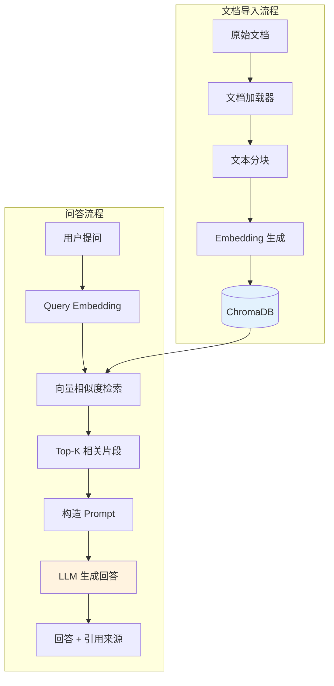

# P3: RAG 知识库

::: info 项目信息
**难度**: 中级 | **代码量**: ~500 行 | **预计时间**: 6-8 小时
**对应章节**: 中级篇第 7-8 章（RAG、记忆系统）
:::

## 项目目标

构建一个能导入文档并智能问答的知识库系统。用户可以导入 PDF、Markdown、TXT 文件，系统自动处理文档、建立索引，然后通过自然语言提问获取精准回答，并标注信息来源。

### 功能清单

- [x] 文档导入（支持 PDF、Markdown、TXT）
- [x] 智能文档分块（按语义边界切分）
- [x] 向量化存储（Embedding + ChromaDB）
- [x] 语义检索与相关性排序
- [x] 基于检索结果的回答生成
- [x] 引用来源标注（标明答案出自哪份文档的哪个部分）
- [x] 多轮追问支持（带上下文的连续提问）
- [x] 知识库管理（查看文档列表、删除文档）

## 技术栈

| 组件 | 选择 | 理由 |
|------|------|------|
| LLM | Anthropic Claude | 长上下文理解能力强 |
| Embedding | `sentence-transformers` | 本地运行，无需额外 API 费用 |
| 向量数据库 | ChromaDB | 轻量级，纯 Python，适合学习 |
| 文档加载 | LangChain Loaders | 成熟的多格式文档加载方案 |
| 文本分块 | LangChain Splitters | 丰富的分块策略 |

## 架构设计



## 项目结构

```
rag-knowledge-base/
├── main.py              # 主程序入口（CLI 交互）
├── indexer.py           # 文档处理与索引
├── retriever.py         # 检索与排序
├── generator.py         # RAG 生成器
├── models.py            # 数据模型定义
├── .env
└── data/
    ├── documents/       # 原始文档存放
    └── chroma_db/       # ChromaDB 持久化存储
```

## 分步实现

### 第 1 步：文档加载与分块

```python
# indexer.py - 文档处理与索引
from pathlib import Path
from dataclasses import dataclass, field

from langchain_community.document_loaders import (
    PyPDFLoader,
    TextLoader,
    UnstructuredMarkdownLoader,
)
from langchain.text_splitter import RecursiveCharacterTextSplitter


@dataclass
class DocumentChunk:
    """文档片段"""
    content: str
    metadata: dict = field(default_factory=dict)
    # metadata 包含: source (文件名), page (页码), chunk_index (片段序号)


# 文件类型 → 加载器 映射
LOADER_MAP = {
    ".pdf": PyPDFLoader,
    ".txt": TextLoader,
    ".md": UnstructuredMarkdownLoader,
}


def load_document(file_path: str) -> list[DocumentChunk]:
    """加载文档并切分为片段"""
    path = Path(file_path)
    suffix = path.suffix.lower()

    if suffix not in LOADER_MAP:
        raise ValueError(f"不支持的文件格式: {suffix}。支持: {list(LOADER_MAP.keys())}")

    # 1. 加载文档
    loader_class = LOADER_MAP[suffix]
    loader = loader_class(str(path))
    documents = loader.load()

    # 2. 文本分块
    splitter = RecursiveCharacterTextSplitter(
        chunk_size=500,        # 每块约 500 字符
        chunk_overlap=50,      # 块间重叠 50 字符（保持上下文连贯）
        separators=["\n\n", "\n", "。", ".", " ", ""],
        length_function=len,
    )
    splits = splitter.split_documents(documents)

    # 3. 转换为统一格式
    chunks = []
    for i, doc in enumerate(splits):
        chunks.append(
            DocumentChunk(
                content=doc.page_content,
                metadata={
                    "source": path.name,
                    "page": doc.metadata.get("page", 0),
                    "chunk_index": i,
                    "total_chunks": len(splits),
                },
            )
        )

    return chunks
```

::: tip 分块策略
`RecursiveCharacterTextSplitter` 会按优先级尝试分隔符：先按双换行（段落）、再按单换行、再按句号，最后按空格。这保证了切分点尽量在语义边界上。`chunk_overlap=50` 让相邻片段有重叠，避免信息被切断。
:::

### 第 2 步：Embedding 生成与存储

```python
# indexer.py - 续：向量化与存储
import chromadb
from sentence_transformers import SentenceTransformer

# 使用多语言 Embedding 模型（支持中英文）
EMBEDDING_MODEL = "paraphrase-multilingual-MiniLM-L12-v2"


class KnowledgeIndex:
    """知识库索引管理"""

    def __init__(self, persist_dir: str = "./data/chroma_db"):
        self.embed_model = SentenceTransformer(EMBEDDING_MODEL)
        self.chroma_client = chromadb.PersistentClient(path=persist_dir)
        self.collection = self.chroma_client.get_or_create_collection(
            name="knowledge_base",
            metadata={"hnsw:space": "cosine"},  # 使用余弦相似度
        )

    def add_document(self, file_path: str) -> int:
        """导入文档到知识库"""
        chunks = load_document(file_path)

        ids = []
        documents = []
        metadatas = []
        embeddings = []

        for chunk in chunks:
            chunk_id = f"{chunk.metadata['source']}_{chunk.metadata['chunk_index']}"
            ids.append(chunk_id)
            documents.append(chunk.content)
            metadatas.append(chunk.metadata)

        # 批量生成 Embedding
        embeddings = self.embed_model.encode(
            documents, show_progress_bar=True
        ).tolist()

        # 写入 ChromaDB
        self.collection.add(
            ids=ids,
            documents=documents,
            metadatas=metadatas,
            embeddings=embeddings,
        )

        return len(chunks)

    def list_documents(self) -> list[str]:
        """列出已索引的文档"""
        results = self.collection.get()
        sources = set()
        for meta in results["metadatas"]:
            sources.add(meta["source"])
        return sorted(sources)

    def delete_document(self, source_name: str) -> int:
        """删除指定文档的所有片段"""
        results = self.collection.get(where={"source": source_name})
        if results["ids"]:
            self.collection.delete(ids=results["ids"])
        return len(results["ids"])

    def get_stats(self) -> dict:
        """获取知识库统计信息"""
        count = self.collection.count()
        docs = self.list_documents()
        return {
            "total_chunks": count,
            "total_documents": len(docs),
            "documents": docs,
        }
```

### 第 3 步：检索与排序

```python
# retriever.py - 语义检索
from indexer import KnowledgeIndex


class KnowledgeRetriever:
    """知识库检索器"""

    def __init__(self, index: KnowledgeIndex):
        self.index = index

    def search(self, query: str, top_k: int = 5) -> list[dict]:
        """
        语义检索：将 query 向量化，在知识库中找最相似的片段。

        返回格式:
        [
            {
                "content": "片段文本...",
                "source": "文件名.pdf",
                "page": 3,
                "score": 0.85,  # 相似度分数
            },
            ...
        ]
        """
        # 生成 query 的 Embedding
        query_embedding = self.index.embed_model.encode(query).tolist()

        # ChromaDB 相似度搜索
        results = self.index.collection.query(
            query_embeddings=[query_embedding],
            n_results=top_k,
            include=["documents", "metadatas", "distances"],
        )

        # 格式化结果
        search_results = []
        for i in range(len(results["ids"][0])):
            # ChromaDB 返回的是距离，转换为相似度
            distance = results["distances"][0][i]
            similarity = 1 - distance  # cosine distance → similarity

            search_results.append({
                "content": results["documents"][0][i],
                "source": results["metadatas"][0][i]["source"],
                "page": results["metadatas"][0][i].get("page", 0),
                "chunk_index": results["metadatas"][0][i].get("chunk_index", 0),
                "score": round(similarity, 4),
            })

        return search_results
```

### 第 4 步：基于检索结果的生成

```python
# generator.py - RAG 生成器
import anthropic
from dotenv import load_dotenv

load_dotenv()


class RAGGenerator:
    """基于检索结果的回答生成器"""

    def __init__(self, model: str = "claude-sonnet-4-20250514"):
        self.client = anthropic.Anthropic()
        self.model = model
        self.conversation_history: list[dict] = []

    def generate(
        self, query: str, search_results: list[dict], stream: bool = True
    ) -> str:
        """根据检索结果生成回答"""

        # 构造包含检索结果的 Prompt
        context = self._build_context(search_results)

        system_prompt = (
            "你是一个知识库问答助手。根据提供的参考资料回答用户的问题。\n\n"
            "规则：\n"
            "1. 只基于提供的参考资料回答，不要使用你自己的知识\n"
            "2. 如果参考资料中没有相关信息，明确告知用户\n"
            "3. 在回答末尾标注引用来源，格式为 [来源: 文件名, 第X页]\n"
            "4. 如果多个片段提供了不同角度的信息，综合整理后回答\n"
            "5. 保持回答简洁准确，不要过度展开"
        )

        # 构造用户消息（包含检索上下文）
        user_message = f"""参考资料：
{context}

用户问题：{query}

请基于以上参考资料回答问题，并在末尾标注引用来源。"""

        self.conversation_history.append({"role": "user", "content": user_message})

        # 调用 LLM 生成
        if stream:
            return self._stream_generate(system_prompt)
        else:
            return self._sync_generate(system_prompt)

    def _build_context(self, search_results: list[dict]) -> str:
        """将检索结果格式化为上下文文本"""
        context_parts = []
        for i, result in enumerate(search_results, 1):
            context_parts.append(
                f"[片段{i}] (来源: {result['source']}, "
                f"第{result['page']}页, 相关度: {result['score']})\n"
                f"{result['content']}"
            )
        return "\n\n---\n\n".join(context_parts)

    def _stream_generate(self, system_prompt: str) -> str:
        full_response = ""
        with self.client.messages.stream(
            model=self.model,
            max_tokens=2048,
            system=system_prompt,
            messages=self.conversation_history,
        ) as stream:
            for text in stream.text_stream:
                print(text, end="", flush=True)
                full_response += text

        print()
        self.conversation_history.append(
            {"role": "assistant", "content": full_response}
        )
        return full_response

    def _sync_generate(self, system_prompt: str) -> str:
        response = self.client.messages.create(
            model=self.model,
            max_tokens=2048,
            system=system_prompt,
            messages=self.conversation_history,
        )
        text = response.content[0].text
        self.conversation_history.append({"role": "assistant", "content": text})
        return text

    def clear_history(self):
        """清空对话历史（保留知识库索引）"""
        self.conversation_history = []
```

### 第 5 步：引用来源标注

引用标注已经集成在 System Prompt 中。LLM 会自动在回答末尾添加来源引用。我们在检索结果中提供了 `source`（文件名）和 `page`（页码）信息，LLM 会据此生成引用。

### 第 6 步：多轮追问支持

```python
# generator.py 中的多轮追问
def follow_up(self, query: str, search_results: list[dict]) -> str:
    """
    追问模式：在已有对话上下文基础上继续提问。
    不同于首次提问，追问会带上之前的对话历史。
    """
    context = self._build_context(search_results)

    # 追问时只补充新的检索结果，不重复 system prompt 要求
    user_message = f"""补充参考资料：
{context}

追问：{query}"""

    self.conversation_history.append({"role": "user", "content": user_message})
    return self._stream_generate(
        "你是知识库问答助手。继续基于参考资料回答用户的追问。标注引用来源。"
    )
```

## 主程序入口

```python
# main.py - CLI 交互入口
from pathlib import Path

from rich.console import Console
from rich.panel import Panel
from rich.table import Table

from indexer import KnowledgeIndex
from retriever import KnowledgeRetriever
from generator import RAGGenerator

console = Console()
DOC_DIR = Path("./data/documents")
DOC_DIR.mkdir(parents=True, exist_ok=True)


def main():
    # 初始化组件
    index = KnowledgeIndex()
    retriever = KnowledgeRetriever(index)
    generator = RAGGenerator()

    console.print(
        Panel(
            "[bold]RAG Knowledge Base[/] - 智能知识库问答系统\n\n"
            "命令:\n"
            "  /import <文件路径>  导入文档\n"
            "  /list              查看已导入的文档\n"
            "  /delete <文件名>    删除文档\n"
            "  /stats             知识库统计\n"
            "  /clear             清空对话历史\n"
            "  /exit              退出\n\n"
            "直接输入问题即可进行知识库问答。",
            border_style="blue",
        )
    )

    is_follow_up = False

    while True:
        try:
            user_input = console.input("\n[bold green]You:[/] ").strip()

            if not user_input:
                continue

            # 命令处理
            if user_input.startswith("/"):
                parts = user_input.split(maxsplit=1)
                cmd = parts[0].lower()
                arg = parts[1].strip() if len(parts) > 1 else ""

                if cmd == "/import":
                    if not arg:
                        console.print("[red]请指定文件路径[/]")
                        continue
                    path = Path(arg)
                    if not path.exists():
                        console.print(f"[red]文件不存在: {arg}[/]")
                        continue
                    console.print(f"[dim]正在处理 {path.name}...[/]")
                    count = index.add_document(str(path))
                    console.print(
                        f"[green]导入成功: {path.name} ({count} 个片段)[/]"
                    )

                elif cmd == "/list":
                    docs = index.list_documents()
                    if docs:
                        for doc in docs:
                            console.print(f"  - {doc}")
                    else:
                        console.print("  [dim]知识库为空[/]")

                elif cmd == "/delete":
                    if not arg:
                        console.print("[red]请指定文件名[/]")
                        continue
                    count = index.delete_document(arg)
                    console.print(f"[green]已删除 {arg} ({count} 个片段)[/]")

                elif cmd == "/stats":
                    stats = index.get_stats()
                    table = Table(title="知识库统计")
                    table.add_column("指标", style="cyan")
                    table.add_column("值", style="green")
                    table.add_row("文档数量", str(stats["total_documents"]))
                    table.add_row("片段总数", str(stats["total_chunks"]))
                    table.add_row("文档列表", ", ".join(stats["documents"]))
                    console.print(table)

                elif cmd == "/clear":
                    generator.clear_history()
                    is_follow_up = False
                    console.print("[green]对话历史已清空[/]")

                elif cmd == "/exit":
                    break

                continue

            # 知识库问答
            if index.collection.count() == 0:
                console.print("[yellow]知识库为空，请先使用 /import 导入文档[/]")
                continue

            # 检索相关片段
            console.print("[dim]正在检索...[/]")
            results = retriever.search(user_input, top_k=5)

            # 显示检索结果摘要
            console.print(f"[dim]找到 {len(results)} 个相关片段 "
                         f"(最高相关度: {results[0]['score']:.2%})[/]")

            # 生成回答
            console.print("\n[bold blue]Assistant:[/]")
            if is_follow_up:
                generator.follow_up(user_input, results)
            else:
                generator.generate(user_input, results)

            is_follow_up = True

        except KeyboardInterrupt:
            console.print("\n[dim]输入 /exit 退出[/]")
        except Exception as e:
            console.print(f"[red]错误: {e}[/]")


if __name__ == "__main__":
    main()
```

## 运行和测试

### 安装依赖

```bash
mkdir rag-knowledge-base && cd rag-knowledge-base
uv init
uv add anthropic chromadb sentence-transformers rich python-dotenv
uv add langchain langchain-community pypdf unstructured

echo "ANTHROPIC_API_KEY=sk-ant-xxx" > .env
mkdir -p data/documents
```

### 准备测试文档

在 `data/documents/` 下放置几份测试文档（PDF、Markdown、TXT 均可）。

### 运行

```bash
uv run python main.py
```

### 测试流程

```
You: /import data/documents/python-guide.pdf
>>> 导入成功: python-guide.pdf (45 个片段)

You: /import data/documents/project-notes.md
>>> 导入成功: project-notes.md (12 个片段)

You: /stats
>>> 文档数量: 2, 片段总数: 57

You: Python 中如何处理异常？
>>> [检索到 5 个相关片段]
>>> Assistant: 根据参考资料，Python 的异常处理使用 try-except 语法...
>>> [来源: python-guide.pdf, 第12页]

You: 能举个具体的例子吗？
>>> [追问模式，带上下文继续回答]
```

## 评估知识库问答质量

### 评估维度

| 维度 | 评估方法 | 指标 |
|------|---------|------|
| **检索质量** | 人工检查 top-5 片段的相关性 | 精确率 (Precision@5) |
| **回答准确性** | 回答是否基于检索结果，有无编造 | 忠实度 (Faithfulness) |
| **引用正确性** | 引用的来源是否真实、页码是否正确 | 引用准确率 |
| **追问连贯性** | 多轮追问是否保持上下文一致 | 人工评分 1-5 |

### 简易评估脚本

```python
# evaluate.py - 简易评估
test_cases = [
    {
        "question": "Python 中如何定义函数？",
        "expected_keywords": ["def", "函数", "参数"],
        "expected_source": "python-guide.pdf",
    },
    # 添加更多测试用例...
]

def evaluate(generator, retriever, test_cases):
    """运行评估测试"""
    results = []
    for case in test_cases:
        search_results = retriever.search(case["question"])
        answer = generator.generate(case["question"], search_results, stream=False)

        # 关键词覆盖率
        keywords_found = sum(
            1 for kw in case["expected_keywords"] if kw in answer
        )
        coverage = keywords_found / len(case["expected_keywords"])

        # 来源准确性
        source_correct = case["expected_source"] in answer

        results.append({
            "question": case["question"],
            "keyword_coverage": coverage,
            "source_correct": source_correct,
        })

    return results
```

## 扩展建议

1. **Hybrid Search** -- 结合关键词搜索 (BM25) 和向量搜索，提升检索质量
2. **Reranking** -- 使用 Cohere Rerank 或交叉编码器对检索结果重排序
3. **Web UI** -- 使用 Gradio 或 Streamlit 构建简易 Web 界面
4. **增量更新** -- 支持文档更新时只重新索引变更部分
5. **多模态支持** -- 支持图片、表格等非文本内容的提取和检索

## 参考资源

- [Anthropic RAG Guide](https://docs.anthropic.com/en/docs/build-with-claude/retrieval-augmented-generation) -- 官方 RAG 实践指南
- [ChromaDB 文档](https://docs.trychroma.com/) -- 向量数据库完整文档
- [Sentence-Transformers](https://www.sbert.net/) -- Embedding 模型库文档
- [LangChain Document Loaders](https://python.langchain.com/docs/integrations/document_loaders/) -- 文档加载器大全
- [Retrieval-Augmented Generation for Knowledge-Intensive NLP Tasks](https://arxiv.org/abs/2005.11401) -- RAG 开创性论文
- [Chunking Strategies for LLM Applications](https://www.pinecone.io/learn/chunking-strategies/) -- Pinecone 的分块策略深度指南
