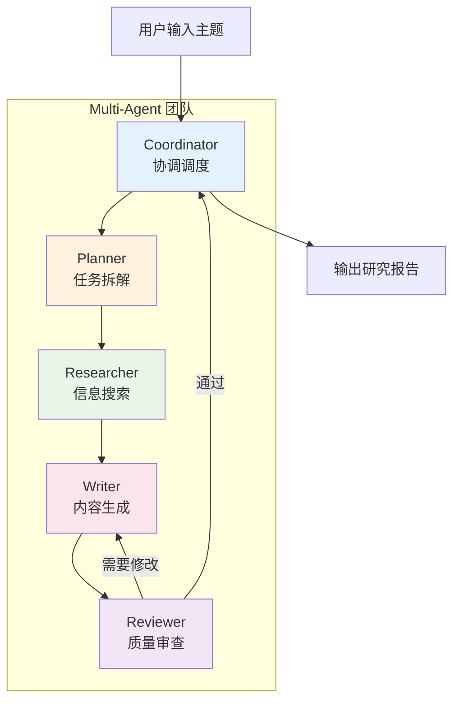
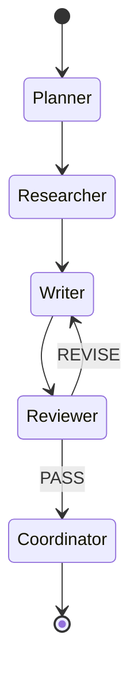

# P4: Multi-Agent 团队

::: info 项目信息
**难度**: 中级 | **代码量**: ~600 行 | **预计时间**: 8-10 小时
**对应章节**: 中级篇第 6 章（Agent 核心原理）、第 9 章（Agent 框架）、第 10 章（Multi-Agent）
:::

## 项目目标

构建一个由多个专家 Agent 协作完成任务的系统。输入一个研究主题，系统自动经过任务拆解、信息搜索、内容撰写、质量审查四个阶段，最终输出一篇结构完整的研究报告。

这个项目展示了 Multi-Agent 系统的核心问题：**如何让多个各有所长的 Agent 高效协作**。

### 功能清单

- [x] 5 个专家 Agent：Planner、Researcher、Writer、Reviewer、Coordinator
- [x] LangGraph 工作流编排
- [x] Agent 间的消息传递和状态共享
- [x] 质量审查与修改循环
- [x] 完整的执行轨迹日志
- [x] 最终输出格式化报告

## 角色设计



| Agent | 职责 | System Prompt 核心 |
|-------|------|-------------------|
| **Coordinator** | 接收用户需求，协调全流程 | 你是项目经理，负责任务分配和最终交付 |
| **Planner** | 将研究主题拆解为具体子任务 | 你是研究策划专家，擅长拆解复杂问题 |
| **Researcher** | 搜索和整理信息 | 你是资深研究员，擅长信息搜索和筛选 |
| **Writer** | 根据研究素材撰写报告 | 你是技术写作专家，擅长结构化表达 |
| **Reviewer** | 审查报告质量，提出修改意见 | 你是严格的编辑，关注准确性和完整性 |

## 技术栈

| 组件 | 选择 | 理由 |
|------|------|------|
| 工作流编排 | LangGraph | 图状态机，天然适合多 Agent 协作 |
| LLM | Anthropic Claude | 长文本生成质量高 |
| 搜索 | httpx + DuckDuckGo | 轻量级信息搜索 |
| 输出 | Markdown | 通用格式，方便后续处理 |

## 项目结构

```
multi-agent-team/
├── main.py              # 入口：运行 LangGraph 工作流
├── agents.py            # 5 个 Agent 的定义
├── graph.py             # LangGraph 工作流编排
├── state.py             # 共享状态定义
├── tools.py             # Agent 可用的工具
├── .env
└── output/              # 生成的报告存放
```

## 实现详解

### 共享状态定义

LangGraph 的核心概念是**状态图**（State Graph）。所有 Agent 通过共享状态传递数据：

```python
# state.py - 共享状态
from typing import TypedDict, Annotated
from langgraph.graph.message import add_messages


class TeamState(TypedDict):
    """Multi-Agent 团队共享状态"""
    # 用户输入的研究主题
    topic: str

    # Planner 输出：任务拆解结果
    research_plan: str

    # Researcher 输出：搜索到的资料
    research_materials: str

    # Writer 输出：报告草稿
    draft: str

    # Reviewer 输出：审查意见
    review_feedback: str

    # 审查是否通过
    review_passed: bool

    # 修改轮次计数
    revision_count: int

    # 最终报告
    final_report: str

    # 执行日志
    logs: Annotated[list[str], lambda x, y: x + y]
```

### Agent 定义

```python
# agents.py - Agent 实现
import anthropic
from dotenv import load_dotenv

load_dotenv()

client = anthropic.Anthropic()
MODEL = "claude-sonnet-4-20250514"


def call_llm(system: str, prompt: str, max_tokens: int = 4096) -> str:
    """统一的 LLM 调用封装"""
    response = client.messages.create(
        model=MODEL,
        max_tokens=max_tokens,
        system=system,
        messages=[{"role": "user", "content": prompt}],
    )
    return response.content[0].text


# ============================================================
# Planner Agent - 任务拆解
# ============================================================
def planner_agent(state: dict) -> dict:
    """将研究主题拆解为具体的研究计划"""
    system = (
        "你是一位资深的研究策划专家。你的职责是将一个研究主题拆解为具体的、"
        "可执行的研究子任务。\n\n"
        "输出格式：\n"
        "1. 研究背景（需要了解什么背景知识）\n"
        "2. 核心问题（需要回答的 3-5 个关键问题）\n"
        "3. 研究大纲（报告的章节结构）\n"
        "4. 关键搜索词（用于信息检索的关键词列表）"
    )
    prompt = f"请为以下研究主题制定详细的研究计划：\n\n{state['topic']}"

    plan = call_llm(system, prompt)
    return {
        "research_plan": plan,
        "logs": [f"[Planner] 研究计划制定完成"],
    }


# ============================================================
# Researcher Agent - 信息搜索
# ============================================================
def researcher_agent(state: dict) -> dict:
    """根据研究计划搜索和整理信息"""
    system = (
        "你是一位资深研究员，擅长信息搜索和整理。\n"
        "你的任务是根据研究计划，搜索并整理相关信息。\n"
        "输出要求：\n"
        "1. 为每个研究子任务提供关键信息\n"
        "2. 标注信息来源（如有）\n"
        "3. 区分事实和观点\n"
        "4. 提供数据和案例支持"
    )
    prompt = (
        f"研究主题：{state['topic']}\n\n"
        f"研究计划：\n{state['research_plan']}\n\n"
        "请根据以上研究计划，搜索并整理相关信息和素材。"
    )

    materials = call_llm(system, prompt, max_tokens=6000)
    return {
        "research_materials": materials,
        "logs": [f"[Researcher] 信息搜索完成"],
    }


# ============================================================
# Writer Agent - 内容撰写
# ============================================================
def writer_agent(state: dict) -> dict:
    """根据素材撰写研究报告"""
    has_feedback = state.get("review_feedback") and state["revision_count"] > 0

    system = (
        "你是一位技术写作专家，擅长将复杂信息转化为清晰的结构化报告。\n"
        "报告要求：\n"
        "1. 使用 Markdown 格式\n"
        "2. 包含标题、摘要、正文、总结\n"
        "3. 每个论点要有数据或案例支撑\n"
        "4. 语言专业但易读\n"
        "5. 字数 2000-3000 字"
    )

    if has_feedback:
        prompt = (
            f"研究主题：{state['topic']}\n\n"
            f"当前草稿：\n{state['draft']}\n\n"
            f"审查意见：\n{state['review_feedback']}\n\n"
            "请根据审查意见修改报告。保留原文好的部分，改进不足之处。"
        )
    else:
        prompt = (
            f"研究主题：{state['topic']}\n\n"
            f"研究计划：\n{state['research_plan']}\n\n"
            f"研究素材：\n{state['research_materials']}\n\n"
            "请基于以上素材撰写一篇完整的研究报告。"
        )

    draft = call_llm(system, prompt, max_tokens=8000)
    revision = state.get("revision_count", 0) + (1 if has_feedback else 0)
    return {
        "draft": draft,
        "revision_count": revision,
        "logs": [f"[Writer] 报告{'修改' if has_feedback else '撰写'}完成 (v{revision + 1})"],
    }


# ============================================================
# Reviewer Agent - 质量审查
# ============================================================
def reviewer_agent(state: dict) -> dict:
    """审查报告质量，决定是否通过"""
    system = (
        "你是一位严格的技术编辑。你的职责是审查研究报告的质量。\n\n"
        "审查维度：\n"
        "1. 内容准确性 — 论述是否有依据\n"
        "2. 结构完整性 — 是否覆盖了研究计划的所有要点\n"
        "3. 逻辑连贯性 — 论证过程是否合理\n"
        "4. 表达清晰度 — 语言是否专业且易懂\n\n"
        "输出格式：\n"
        "1. 总体评分（1-10 分）\n"
        "2. 优点（列举做得好的方面）\n"
        "3. 问题（列举需要改进的地方）\n"
        "4. 结论：PASS 或 REVISE\n\n"
        "评分 >= 7 分输出 PASS，否则输出 REVISE。\n"
        "如果已经修改超过 2 次，即使有小问题也应输出 PASS。"
    )
    prompt = (
        f"研究主题：{state['topic']}\n\n"
        f"研究计划：\n{state['research_plan']}\n\n"
        f"报告草稿（第 {state.get('revision_count', 0) + 1} 版）：\n{state['draft']}"
    )

    feedback = call_llm(system, prompt)

    # 解析审查结果
    passed = "PASS" in feedback.upper() and "REVISE" not in feedback.upper().split("PASS")[-1]
    # 安全网：超过 2 次修改强制通过
    if state.get("revision_count", 0) >= 2:
        passed = True

    return {
        "review_feedback": feedback,
        "review_passed": passed,
        "logs": [f"[Reviewer] 审查完成: {'PASS' if passed else 'REVISE'}"],
    }


# ============================================================
# Coordinator Agent - 最终整理
# ============================================================
def coordinator_agent(state: dict) -> dict:
    """协调调度，整理最终报告"""
    system = (
        "你是项目经理。请为以下研究报告添加封面信息和元数据。\n"
        "格式要求：在报告开头添加：\n"
        "- 研究主题\n"
        "- 生成时间\n"
        "- 修改轮次\n"
        "- 报告正文保持不变"
    )
    prompt = (
        f"研究主题：{state['topic']}\n"
        f"修改轮次：{state.get('revision_count', 0) + 1}\n\n"
        f"报告正文：\n{state['draft']}"
    )

    final = call_llm(system, prompt, max_tokens=8000)
    return {
        "final_report": final,
        "logs": [f"[Coordinator] 最终报告整理完成"],
    }
```

### LangGraph 工作流编排

```python
# graph.py - LangGraph 工作流
from langgraph.graph import StateGraph, END
from state import TeamState
from agents import (
    planner_agent,
    researcher_agent,
    writer_agent,
    reviewer_agent,
    coordinator_agent,
)


def should_revise(state: dict) -> str:
    """条件路由：审查通过则完成，否则修改"""
    if state.get("review_passed", False):
        return "coordinator"
    else:
        return "writer"


def build_graph() -> StateGraph:
    """构建 Multi-Agent 工作流图"""
    graph = StateGraph(TeamState)

    # 添加节点（每个 Agent 是一个节点）
    graph.add_node("planner", planner_agent)
    graph.add_node("researcher", researcher_agent)
    graph.add_node("writer", writer_agent)
    graph.add_node("reviewer", reviewer_agent)
    graph.add_node("coordinator", coordinator_agent)

    # 定义边（执行顺序）
    graph.set_entry_point("planner")
    graph.add_edge("planner", "researcher")
    graph.add_edge("researcher", "writer")
    graph.add_edge("writer", "reviewer")

    # 条件边：审查通过则完成，否则回到 Writer 修改
    graph.add_conditional_edges(
        "reviewer",
        should_revise,
        {
            "writer": "writer",
            "coordinator": "coordinator",
        },
    )

    graph.add_edge("coordinator", END)

    return graph.compile()
```

工作流的状态机图：



### 主程序入口

```python
# main.py - 入口
from datetime import datetime
from pathlib import Path

from rich.console import Console
from rich.panel import Panel

from graph import build_graph

console = Console()
OUTPUT_DIR = Path("output")
OUTPUT_DIR.mkdir(exist_ok=True)


def run_team(topic: str):
    """运行 Multi-Agent 团队"""
    console.print(
        Panel(f"[bold]研究主题:[/] {topic}", border_style="blue")
    )

    # 构建并运行工作流
    workflow = build_graph()

    initial_state = {
        "topic": topic,
        "research_plan": "",
        "research_materials": "",
        "draft": "",
        "review_feedback": "",
        "review_passed": False,
        "revision_count": 0,
        "final_report": "",
        "logs": [],
    }

    # 运行工作流（逐步执行，显示进度）
    console.print("\n[bold]开始执行...[/]\n")

    for step in workflow.stream(initial_state):
        # 每一步都打印日志
        for node_name, node_output in step.items():
            if "logs" in node_output:
                for log in node_output["logs"]:
                    console.print(f"  {log}")

    # 获取最终状态
    final_state = workflow.invoke(initial_state)

    # 保存报告
    timestamp = datetime.now().strftime("%Y%m%d_%H%M%S")
    filename = f"report_{timestamp}.md"
    filepath = OUTPUT_DIR / filename
    filepath.write_text(final_state["final_report"], encoding="utf-8")

    console.print(f"\n[green]报告已保存到: {filepath}[/]")
    console.print(f"[dim]修改轮次: {final_state['revision_count'] + 1}[/]")

    return final_state


def main():
    console.print(
        Panel(
            "[bold]Multi-Agent Research Team[/]\n"
            "输入研究主题，AI 团队将协作生成研究报告\n"
            "输入 'quit' 退出",
            border_style="blue",
        )
    )

    while True:
        topic = console.input("\n[bold green]研究主题:[/] ").strip()
        if not topic:
            continue
        if topic.lower() in ("quit", "exit"):
            break

        try:
            run_team(topic)
        except Exception as e:
            console.print(f"[red]执行错误: {e}[/]")


if __name__ == "__main__":
    main()
```

## 运行演示

```bash
# 安装依赖
mkdir multi-agent-team && cd multi-agent-team
uv init
uv add anthropic langgraph rich python-dotenv httpx
echo "ANTHROPIC_API_KEY=sk-ant-xxx" > .env
mkdir output

# 运行
uv run python main.py
```

输入研究主题后，观察控制台输出：

```
研究主题: AI Agent 的发展现状与未来趋势

开始执行...

  [Planner] 研究计划制定完成
  [Researcher] 信息搜索完成
  [Writer] 报告撰写完成 (v1)
  [Reviewer] 审查完成: REVISE
  [Writer] 报告修改完成 (v2)
  [Reviewer] 审查完成: PASS
  [Coordinator] 最终报告整理完成

报告已保存到: output/report_20260416_150322.md
修改轮次: 2
```

## 扩展建议

1. **添加工具调用** -- 给 Researcher Agent 配备真实的搜索工具（Web Search API）
2. **并行执行** -- 多个 Researcher 并行搜索不同子主题，提升效率
3. **人机协同** -- 在 Reviewer 环节引入人工审查（Human-in-the-Loop）
4. **流式输出** -- 每个 Agent 的输出都流式显示，提升用户体验
5. **可视化面板** -- 用 Web UI 展示 Agent 间的协作流程图和状态变化
6. **自定义团队** -- 支持用户定义 Agent 角色和工作流拓扑

::: warning 成本提示
本项目一次完整运行涉及 5-7 次 LLM 调用（含修改循环），每次调用 2000-8000 tokens。建议开发调试时使用 Claude Haiku，最终演示时使用 Claude Sonnet。一次完整运行的 API 费用约 $0.10-0.30（Sonnet）。
:::

## 参考资源

- [LangGraph 官方文档](https://langchain-ai.github.io/langgraph/) -- 完整的 LangGraph API 参考
- [LangGraph Multi-Agent 教程](https://langchain-ai.github.io/langgraph/tutorials/multi_agent/multi-agent-collaboration/) -- 官方多 Agent 协作教程
- [CrewAI 文档](https://docs.crewai.com/) -- 另一个优秀的多 Agent 框架
- [AutoGen (Microsoft)](https://github.com/microsoft/autogen) -- 微软的多 Agent 对话框架
- [Communicative Agents for Software Development (论文)](https://arxiv.org/abs/2307.07924) -- ChatDev 论文，Multi-Agent 软件开发
- [Building effective agents (Anthropic)](https://www.anthropic.com/research/building-effective-agents) -- Anthropic 官方 Agent 构建指南
