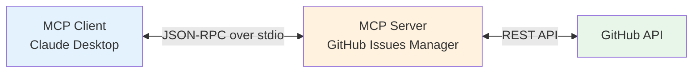

# P5: MCP Server 开发

::: info 项目信息
**难度**: 中高级 | **代码量**: ~400 行 | **预计时间**: 6-8 小时
**对应章节**: 高级篇第 12 章（MCP 协议）
:::

## 项目目标

开发一个实用的 MCP（Model Context Protocol）Server -- **GitHub Issues Manager**。这个 Server 让 Claude Desktop（或任何 MCP 客户端）能够直接管理 GitHub Issues：创建、查询、评论、关闭，无需离开对话界面。

通过这个项目，你将掌握 MCP Server 开发的完整流程：协议理解、工具实现、资源暴露、客户端集成、发布分发。

### 功能清单

- [x] **Tools**: 创建 Issue、查询 Issue 列表、获取 Issue 详情、添加评论、关闭/重开 Issue
- [x] **Resources**: 暴露仓库基本信息、暴露 Label 列表
- [x] Claude Desktop 集成测试
- [x] 完善的错误处理和参数校验
- [x] 发布到 npm（可选）

## MCP 协议回顾



MCP Server 是 AI 模型和外部系统之间的桥梁。它通过标准协议暴露 **Tools**（可执行操作）和 **Resources**（可读数据），让 AI 模型能够与外部世界交互。

## 技术栈

| 组件 | 选择 | 理由 |
|------|------|------|
| MCP SDK | `@modelcontextprotocol/sdk` (Python) | 官方 SDK，协议一致性保证 |
| GitHub API | `httpx` | 轻量 HTTP 客户端 |
| 传输层 | stdio | Claude Desktop 默认通信方式 |
| 包管理 | `uv` | Python 项目管理 |

## 项目结构

```
mcp-github-issues/
├── src/
│   └── github_issues/
│       ├── __init__.py
│       ├── server.py        # MCP Server 主体
│       ├── github_client.py # GitHub API 封装
│       └── models.py        # 数据模型
├── pyproject.toml           # 项目配置
├── .env                     # GitHub Token
└── README.md
```

## 分步实现

### 第 1 步：环境搭建

```bash
# 创建项目
mkdir mcp-github-issues && cd mcp-github-issues
uv init

# 安装依赖
uv add "mcp[cli]" httpx python-dotenv

# 创建源码目录
mkdir -p src/github_issues
touch src/github_issues/__init__.py
```

配置 `pyproject.toml`：

```toml
[project]
name = "mcp-github-issues"
version = "0.1.0"
description = "MCP Server for GitHub Issues management"
requires-python = ">=3.11"
dependencies = [
    "mcp[cli]>=1.0.0",
    "httpx>=0.27.0",
    "python-dotenv>=1.0.0",
]

[project.scripts]
mcp-github-issues = "github_issues.server:main"
```

### 第 2 步：GitHub API 客户端

```python
# src/github_issues/github_client.py
"""GitHub API 封装 - 提供 Issues 相关操作"""

import httpx
from dataclasses import dataclass


@dataclass
class GitHubConfig:
    token: str
    owner: str
    repo: str
    base_url: str = "https://api.github.com"


class GitHubClient:
    """GitHub REST API 客户端"""

    def __init__(self, config: GitHubConfig):
        self.config = config
        self.client = httpx.Client(
            base_url=config.base_url,
            headers={
                "Authorization": f"Bearer {config.token}",
                "Accept": "application/vnd.github+json",
                "X-GitHub-Api-Version": "2022-11-28",
            },
            timeout=30,
        )

    @property
    def repo_path(self) -> str:
        return f"/repos/{self.config.owner}/{self.config.repo}"

    # ----------------------------------------------------------
    # Issues 操作
    # ----------------------------------------------------------
    def list_issues(
        self, state: str = "open", labels: str = "", per_page: int = 20
    ) -> list[dict]:
        """获取 Issue 列表"""
        params = {"state": state, "per_page": per_page, "sort": "updated"}
        if labels:
            params["labels"] = labels

        resp = self.client.get(f"{self.repo_path}/issues", params=params)
        resp.raise_for_status()
        # 过滤掉 PR（GitHub API 把 PR 也算作 Issue）
        return [
            issue for issue in resp.json()
            if "pull_request" not in issue
        ]

    def get_issue(self, issue_number: int) -> dict:
        """获取 Issue 详情"""
        resp = self.client.get(f"{self.repo_path}/issues/{issue_number}")
        resp.raise_for_status()
        return resp.json()

    def create_issue(self, title: str, body: str = "", labels: list[str] = None) -> dict:
        """创建新 Issue"""
        data = {"title": title, "body": body}
        if labels:
            data["labels"] = labels

        resp = self.client.post(f"{self.repo_path}/issues", json=data)
        resp.raise_for_status()
        return resp.json()

    def add_comment(self, issue_number: int, body: str) -> dict:
        """为 Issue 添加评论"""
        resp = self.client.post(
            f"{self.repo_path}/issues/{issue_number}/comments",
            json={"body": body},
        )
        resp.raise_for_status()
        return resp.json()

    def update_issue(self, issue_number: int, **kwargs) -> dict:
        """更新 Issue（关闭/重开/修改标题等）"""
        resp = self.client.patch(
            f"{self.repo_path}/issues/{issue_number}",
            json=kwargs,
        )
        resp.raise_for_status()
        return resp.json()

    # ----------------------------------------------------------
    # 仓库信息
    # ----------------------------------------------------------
    def get_repo_info(self) -> dict:
        """获取仓库基本信息"""
        resp = self.client.get(self.repo_path)
        resp.raise_for_status()
        return resp.json()

    def list_labels(self) -> list[dict]:
        """获取仓库的 Label 列表"""
        resp = self.client.get(f"{self.repo_path}/labels", params={"per_page": 100})
        resp.raise_for_status()
        return resp.json()
```

### 第 3 步：MCP Server 实现

这是核心部分 -- 定义 Tools 和 Resources：

```python
# src/github_issues/server.py
"""MCP Server - GitHub Issues Manager"""

import os
import json
import logging

from dotenv import load_dotenv
from mcp.server import Server
from mcp.server.stdio import stdio_server
from mcp.types import (
    Tool,
    TextContent,
    Resource,
    ResourceTemplate,
)

from .github_client import GitHubClient, GitHubConfig

load_dotenv()
logger = logging.getLogger(__name__)

# ============================================================
# 初始化
# ============================================================
server = Server("github-issues-manager")

def get_github_client() -> GitHubClient:
    """从环境变量创建 GitHub 客户端"""
    token = os.environ.get("GITHUB_TOKEN")
    owner = os.environ.get("GITHUB_OWNER")
    repo = os.environ.get("GITHUB_REPO")

    if not all([token, owner, repo]):
        raise ValueError(
            "请设置环境变量: GITHUB_TOKEN, GITHUB_OWNER, GITHUB_REPO"
        )

    return GitHubClient(GitHubConfig(token=token, owner=owner, repo=repo))


# ============================================================
# Tools 定义
# ============================================================
@server.list_tools()
async def list_tools() -> list[Tool]:
    """声明 Server 提供的所有工具"""
    return [
        Tool(
            name="list_issues",
            description="获取 GitHub Issue 列表。可按状态和标签筛选。",
            inputSchema={
                "type": "object",
                "properties": {
                    "state": {
                        "type": "string",
                        "description": "Issue 状态: open, closed, all",
                        "default": "open",
                        "enum": ["open", "closed", "all"],
                    },
                    "labels": {
                        "type": "string",
                        "description": "按标签筛选，多个标签用逗号分隔",
                        "default": "",
                    },
                    "per_page": {
                        "type": "integer",
                        "description": "每页数量，默认 20",
                        "default": 20,
                    },
                },
            },
        ),
        Tool(
            name="get_issue",
            description="获取指定 Issue 的详细信息，包括标题、正文、标签、评论等。",
            inputSchema={
                "type": "object",
                "properties": {
                    "issue_number": {
                        "type": "integer",
                        "description": "Issue 编号",
                    },
                },
                "required": ["issue_number"],
            },
        ),
        Tool(
            name="create_issue",
            description="创建新的 GitHub Issue。",
            inputSchema={
                "type": "object",
                "properties": {
                    "title": {
                        "type": "string",
                        "description": "Issue 标题",
                    },
                    "body": {
                        "type": "string",
                        "description": "Issue 正文（支持 Markdown）",
                        "default": "",
                    },
                    "labels": {
                        "type": "array",
                        "items": {"type": "string"},
                        "description": "标签列表",
                        "default": [],
                    },
                },
                "required": ["title"],
            },
        ),
        Tool(
            name="add_comment",
            description="为指定 Issue 添加评论。",
            inputSchema={
                "type": "object",
                "properties": {
                    "issue_number": {
                        "type": "integer",
                        "description": "Issue 编号",
                    },
                    "body": {
                        "type": "string",
                        "description": "评论内容（支持 Markdown）",
                    },
                },
                "required": ["issue_number", "body"],
            },
        ),
        Tool(
            name="close_issue",
            description="关闭指定的 Issue。",
            inputSchema={
                "type": "object",
                "properties": {
                    "issue_number": {
                        "type": "integer",
                        "description": "Issue 编号",
                    },
                    "reason": {
                        "type": "string",
                        "description": "关闭原因: completed 或 not_planned",
                        "enum": ["completed", "not_planned"],
                        "default": "completed",
                    },
                },
                "required": ["issue_number"],
            },
        ),
        Tool(
            name="reopen_issue",
            description="重新打开已关闭的 Issue。",
            inputSchema={
                "type": "object",
                "properties": {
                    "issue_number": {
                        "type": "integer",
                        "description": "Issue 编号",
                    },
                },
                "required": ["issue_number"],
            },
        ),
    ]


@server.call_tool()
async def call_tool(name: str, arguments: dict) -> list[TextContent]:
    """处理工具调用"""
    gh = get_github_client()

    try:
        if name == "list_issues":
            issues = gh.list_issues(
                state=arguments.get("state", "open"),
                labels=arguments.get("labels", ""),
                per_page=arguments.get("per_page", 20),
            )
            # 格式化输出
            result = []
            for issue in issues:
                labels = ", ".join(l["name"] for l in issue.get("labels", []))
                result.append(
                    f"#{issue['number']} [{issue['state']}] {issue['title']}"
                    f"{f' ({labels})' if labels else ''}"
                    f" - {issue['user']['login']}"
                )
            text = "\n".join(result) if result else "没有找到匹配的 Issue。"

        elif name == "get_issue":
            issue = gh.get_issue(arguments["issue_number"])
            text = (
                f"# #{issue['number']} {issue['title']}\n\n"
                f"**状态**: {issue['state']}\n"
                f"**作者**: {issue['user']['login']}\n"
                f"**标签**: {', '.join(l['name'] for l in issue.get('labels', []))}\n"
                f"**创建时间**: {issue['created_at']}\n"
                f"**评论数**: {issue['comments']}\n\n"
                f"---\n\n{issue.get('body', '(无正文)')}"
            )

        elif name == "create_issue":
            issue = gh.create_issue(
                title=arguments["title"],
                body=arguments.get("body", ""),
                labels=arguments.get("labels"),
            )
            text = f"Issue 创建成功: #{issue['number']} {issue['title']}\nURL: {issue['html_url']}"

        elif name == "add_comment":
            comment = gh.add_comment(
                issue_number=arguments["issue_number"],
                body=arguments["body"],
            )
            text = f"评论添加成功: {comment['html_url']}"

        elif name == "close_issue":
            issue = gh.update_issue(
                issue_number=arguments["issue_number"],
                state="closed",
                state_reason=arguments.get("reason", "completed"),
            )
            text = f"Issue #{issue['number']} 已关闭。"

        elif name == "reopen_issue":
            issue = gh.update_issue(
                issue_number=arguments["issue_number"],
                state="open",
            )
            text = f"Issue #{issue['number']} 已重新打开。"

        else:
            text = f"未知工具: {name}"

    except Exception as e:
        text = f"操作失败: {str(e)}"
        logger.error(f"Tool {name} failed: {e}")

    return [TextContent(type="text", text=text)]


# ============================================================
# Resources 定义
# ============================================================
@server.list_resources()
async def list_resources() -> list[Resource]:
    """声明可读资源"""
    gh = get_github_client()
    repo_info = gh.get_repo_info()

    return [
        Resource(
            uri=f"github://{repo_info['full_name']}/info",
            name=f"仓库信息: {repo_info['full_name']}",
            description="仓库的基本信息，包括描述、星标数、语言等",
            mimeType="application/json",
        ),
        Resource(
            uri=f"github://{repo_info['full_name']}/labels",
            name=f"标签列表: {repo_info['full_name']}",
            description="仓库中所有可用的 Issue 标签",
            mimeType="application/json",
        ),
    ]


@server.read_resource()
async def read_resource(uri: str) -> str:
    """读取资源内容"""
    gh = get_github_client()

    if uri.endswith("/info"):
        repo = gh.get_repo_info()
        data = {
            "name": repo["full_name"],
            "description": repo.get("description", ""),
            "language": repo.get("language", ""),
            "stars": repo["stargazers_count"],
            "forks": repo["forks_count"],
            "open_issues": repo["open_issues_count"],
            "default_branch": repo["default_branch"],
            "url": repo["html_url"],
        }
        return json.dumps(data, indent=2, ensure_ascii=False)

    elif uri.endswith("/labels"):
        labels = gh.list_labels()
        data = [
            {"name": l["name"], "color": l["color"], "description": l.get("description", "")}
            for l in labels
        ]
        return json.dumps(data, indent=2, ensure_ascii=False)

    raise ValueError(f"未知资源: {uri}")


# ============================================================
# 入口
# ============================================================
async def run():
    async with stdio_server() as (read_stream, write_stream):
        await server.run(
            read_stream,
            write_stream,
            server.create_initialization_options(),
        )


def main():
    import asyncio
    asyncio.run(run())


if __name__ == "__main__":
    main()
```

### 第 4 步：在 Claude Desktop 中测试

配置 Claude Desktop 的 `claude_desktop_config.json`：

```json
{
  "mcpServers": {
    "github-issues": {
      "command": "uv",
      "args": [
        "--directory",
        "/path/to/mcp-github-issues",
        "run",
        "mcp-github-issues"
      ],
      "env": {
        "GITHUB_TOKEN": "ghp_xxxxxxxxxxxx",
        "GITHUB_OWNER": "your-username",
        "GITHUB_REPO": "your-repo"
      }
    }
  }
}
```

::: tip 配置文件位置
- macOS: `~/Library/Application Support/Claude/claude_desktop_config.json`
- Windows: `%APPDATA%\Claude\claude_desktop_config.json`
:::

重启 Claude Desktop 后，在对话中尝试：

```
"帮我查看当前仓库有哪些 open 的 Issue"
"创建一个 Issue，标题是"修复登录页面 bug"，内容是..."
"给 #42 添加一条评论"
"关闭 #38，原因是已完成"
```

### 第 5 步：使用 MCP Inspector 调试

```bash
# 安装 MCP Inspector
npx @modelcontextprotocol/inspector uv run mcp-github-issues
```

MCP Inspector 提供了可视化界面，方便调试 Tools 和 Resources。

## 运行和测试

```bash
# 完整安装步骤
cd mcp-github-issues
uv add "mcp[cli]" httpx python-dotenv

# 配置环境变量
cat > .env << EOF
GITHUB_TOKEN=ghp_your_token_here
GITHUB_OWNER=your_username
GITHUB_REPO=your_repo
EOF

# 使用 Inspector 测试
npx @modelcontextprotocol/inspector uv run mcp-github-issues

# 或直接在 Claude Desktop 中使用
```

## 扩展建议

1. **更多工具** -- 支持 Issue 指派（assignees）、里程碑（milestones）、项目（projects）管理
2. **Prompts** -- 添加 MCP Prompts，如"每日 Issue 摘要"模板
3. **Webhook 集成** -- 通过 SSE 传输实现实时 Issue 更新推送
4. **多仓库支持** -- 允许动态切换管理不同仓库
5. **发布到 npm/PyPI** -- 打包发布，让其他人也能使用你的 MCP Server

## 参考资源

- [Model Context Protocol 官方文档](https://modelcontextprotocol.io/) -- MCP 协议完整规范
- [MCP Python SDK](https://github.com/modelcontextprotocol/python-sdk) -- Python SDK 源码和示例
- [MCP TypeScript SDK](https://github.com/modelcontextprotocol/typescript-sdk) -- TypeScript SDK（参考）
- [MCP Servers 仓库](https://github.com/modelcontextprotocol/servers) -- 官方和社区 MCP Server 合集
- [Claude Desktop MCP 配置指南](https://modelcontextprotocol.io/quickstart/user) -- 客户端集成文档
- [GitHub REST API 文档](https://docs.github.com/en/rest) -- GitHub API 完整参考
