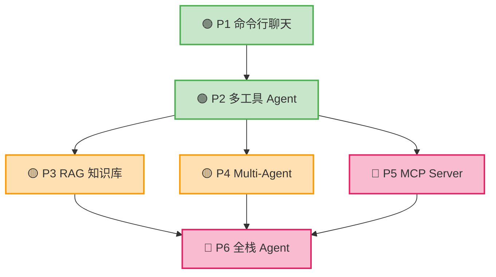

# 学习路线图

> **预计总时长**：12 周（每周 10-15 小时）| **适用人群**：有 1 年以上前端开发经验的工程师 | **目标**：独立开发生产级 AI Agent 应用

这张路线图是你的学习导航仪。不管你现在处于哪个阶段，都可以快速定位自己的位置，知道下一步该学什么。

## 全景路线图

本书 16 个知识主题，每个主题分为**初级/中级/高级**三个深度。推荐的学习方式是**按深度横着读**——先扫完所有初级，再进入中级，最后攻克高级。

<div class="roadmap-overview">

**🟢 初级篇 · 第 1-4 周** — 读完所有章节的初级部分，建立全面概念地图

| 第 1 周 | 第 2 周 | 第 3 周 | 第 4 周 |
|:-------:|:-------:|:-------:|:-------:|
| 1.Python | 5.Tool Use | 9.框架 | 13.安全 |
| 2.LLM | 6.Agent | 10.多Agent | 14.生产 |
| 3.Prompt | 7.RAG | 11.评估 | 15.性能 |
| 4.API | 8.记忆 | 12.MCP | 16.前沿 |

⬇️ 完成项目 P1（命令行聊天）、P2（多工具 Agent） ⬇️

**🔵 中级篇 · 第 5-8 周** — 读完所有章节的中级部分，掌握工程实践

| 第 5 周 | 第 6 周 | 第 7 周 | 第 8 周 |
|:-------:|:-------:|:-------:|:-------:|
| 1.Python | 5.Tool Use | 9.框架 | 13.安全 |
| 2.LLM | 6.Agent | 10.多Agent | 14.生产 |
| 3.Prompt | 7.RAG | 11.评估 | 15.性能 |
| 4.API | 8.记忆 | 12.MCP | 16.前沿 |

⬇️ 完成项目 P3（RAG 知识库）、P4（Multi-Agent 团队） ⬇️

**🔴 高级篇 · 第 9-12 周** — 读完所有章节的高级部分，具备架构设计能力

| 第 9 周 | 第 10 周 | 第 11 周 | 第 12 周 |
|:-------:|:-------:|:-------:|:-------:|
| 1.Python | 5.Tool Use | 9.框架 | 13.安全 |
| 2.LLM | 6.Agent | 10.多Agent | 14.生产 |
| 3.Prompt | 7.RAG | 11.评估 | 15.性能 |
| 4.API | 8.记忆 | 12.MCP | 16.前沿 |

⬇️ 完成项目 P5（MCP Server）、P6（全栈 Agent 应用） ⬇️

</div>

| 阶段 | 读什么 | 读完你能做什么 |
|------|--------|--------------|
| 🟢 初级 | 16 个章节的**初级**部分 | 调 API、写 Prompt、手写简单 Agent |
| 🔵 中级 | 16 个章节的**中级**部分 | 用框架搭 RAG、Multi-Agent 系统 |
| 🔴 高级 | 16 个章节的**高级**部分 | 生产部署、性能调优、自建框架 |

## 你现在在哪？

根据你的当前水平，找到最合适的起点：

| 你的情况 | 从哪开始 | 预计到达 |
|---------|---------|---------|
| 没写过 Python，没调过 AI API | [第 1 章 · 初级](/01-python/beginner) 从头开始 | 12 周后能做全栈 Agent |
| 会 Python，没用过 LLM API | [第 2 章 · 初级](/02-llm-fundamentals/beginner) 跳过 Python | 10 周后能做全栈 Agent |
| 调过 API，写过简单 Prompt | [第 5 章 · 初级](/05-tool-use/beginner) 直奔 Agent 核心 | 8 周后能做全栈 Agent |
| 做过简单 Agent / 用过 LangChain | 初级篇快速扫一遍，然后进[中级篇](#阶段二中级篇第-5-8-周) | 6 周后能做生产级 Agent |
| 有 Agent 开发经验，想深入 | 直接进[高级篇](#阶段三高级篇第-9-12-周) | 4 周后能做架构级设计 |

---

## 阶段一：初级篇（第 1-4 周）

**读什么**：所有 16 个章节的**初级**部分。

**核心目标**：建立全面的概念地图——从 Python 基础到前沿方向，每个知识领域都知道"这是什么、为什么需要它"。初级篇读完，你就能独立写一个简单但完整的 Agent。

### 时间规划

| 周次 | 读哪些章节的初级 | 投入时间 | 核心产出 |
|------|-----------------|---------|---------|
| 第 1 周 | 第 1-4 章初级 | 12h | Python 上手 + LLM/Prompt/API 基础概念 |
| 第 2 周 | 第 5-8 章初级 | 10h | Tool Use + Agent 循环 + RAG/记忆入门 |
| 第 3 周 | 第 9-12 章初级 | 10h | 框架选型 + Multi-Agent + 评估 + MCP 概念 |
| 第 4 周 | 第 13-16 章初级 + 项目 | 15h | 安全/生产/性能概念 + 完成 P1、P2 项目 |

### 各章初级内容速览

| 章节 | 初级主题 | 你会搞懂的问题 | 你能做到的事 |
|------|---------|---------------|------------|
| 第 1 章 | 从 JS 到 Python | Python 和 JS 有啥区别？ | 能用 Python 写异步代码 |
| 第 2 章 | LLM 是什么 | LLM 到底在干嘛？Token 是什么？ | 理解 AI 为什么会"胡说八道" |
| 第 3 章 | Prompt 基础 | 为什么换个问法结果完全不同？ | 能写出稳定输出的 Prompt |
| 第 4 章 | 第一次 API 调用 | API 怎么调？流式输出怎么做？ | 能用代码和 Claude/GPT 对话 |
| 第 5 章 | 工具调用基础 | AI 怎么"使用"工具？ | 能让 AI 调用你写的函数 |
| 第 6 章 | ReAct 与 Agent 循环 | Agent 的核心循环是什么？ | 能从零手写一个 Agent |
| 第 7 章 | RAG 入门 | RAG 是什么？ | 了解检索增强生成的基本流程 |
| 第 8 章 | 对话历史管理 | Agent 怎么记住对话？ | 能管理对话历史 |
| 第 9 章 | 为什么用框架 | 为什么需要框架？ | 了解主流框架的定位 |
| 第 10 章 | 多 Agent 入门 | 多个 Agent 怎么配合？ | 了解多 Agent 的基本模式 |
| 第 11 章 | 为什么评估难 | 怎么知道 Agent 好不好？ | 了解评估的难点 |
| 第 12 章 | MCP 是什么 | MCP 协议有什么用？ | 了解 MCP 的作用和定位 |
| 第 13 章 | Prompt Injection | Prompt 注入是什么？ | 了解基本的安全威胁 |
| 第 14 章 | 从脚本到服务 | Agent 上线要考虑什么？ | 了解生产化的核心挑战 |
| 第 15 章 | 延迟分析 | 为什么 Agent 很慢？ | 了解延迟来源 |
| 第 16 章 | 前沿概念 | 前沿 Agent 在做什么？ | 了解 Computer Use 等新方向 |

### 阶段产出

- 完成项目 P1：CLI 聊天机器人（多轮对话 + 流式输出）
- 完成项目 P2：多工具 Agent（天气查询 + 网页搜索）
- 对 Agent 开发全貌有清晰的概念地图

---

## 阶段二：中级篇（第 5-8 周）

**读什么**：所有 16 个章节的**中级**部分。

**核心目标**：深入每个领域的工程实践——会用框架、会搭 RAG、会写 MCP Server、会做评估。中级篇读完，你就能用主流框架构建有实际价值的 Agent 系统。

### 时间规划

| 周次 | 读哪些章节的中级 | 投入时间 | 核心产出 |
|------|-----------------|---------|---------|
| 第 5 周 | 第 1-4 章中级 | 10h | Python 异步工程化 + LLM 进阶调用 |
| 第 6 周 | 第 5-8 章中级 | 12h | 多工具协同 + Agent 设计模式 + RAG Pipeline |
| 第 7 周 | 第 9-12 章中级 | 15h | LangGraph 实战 + MCP Server 开发 |
| 第 8 周 | 第 13-16 章中级 + 项目 | 12h | 安全防护 + 架构设计 + 完成 P3、P4 项目 |

### 各章中级内容速览

| 章节 | 中级主题 | 核心技能 |
|------|---------|---------|
| 第 1 章 | 异步与工程化 | async/await 深入、包管理、测试 |
| 第 2 章 | Transformer 架构 | 注意力机制、位置编码、KV Cache |
| 第 3 章 | 高级技巧 | Chain-of-Thought、结构化输出、Prompt 组合 |
| 第 4 章 | 进阶调用技巧 | 流式处理、重试策略、多模型切换 |
| 第 5 章 | 多工具协同 | 工具选择策略、并行调用、错误恢复 |
| 第 6 章 | 设计模式 | ReAct、Plan-and-Execute、Reflection |
| 第 7 章 | 优化检索质量 | 切分策略、混合检索、Reranking |
| 第 8 章 | 短期 + 长期记忆 | 向量存储、记忆压缩、工作记忆 |
| 第 9 章 | 框架深入 | LangGraph 状态机、CrewAI 角色系统 |
| 第 10 章 | 通信与调度 | Agent 间通信协议、任务调度 |
| 第 11 章 | 自动化评估 | 评估指标、自动化测试、回归测试 |
| 第 12 章 | 开发 MCP Server | FastMCP、Tools/Resources/Prompts |
| 第 13 章 | 权限控制与沙箱 | 输入验证、输出过滤、沙箱执行 |
| 第 14 章 | 架构设计 | 微服务、可观测性、配置管理 |
| 第 15 章 | 缓存与并发 | Semantic Cache、并发控制、批处理 |
| 第 16 章 | 实现前沿 Agent | Code Agent、Browser Agent 实现 |

### 阶段产出

- 完成项目 P3：RAG 知识库问答系统
- 完成项目 P4：Multi-Agent 协作写作系统
- 能用框架（LangGraph / CrewAI）构建完整的 Agent 应用

---

## 阶段三：高级篇（第 9-12 周）

**读什么**：所有 16 个章节的**高级**部分。

**核心目标**：掌握生产级的高级技术——自建框架、性能极致优化、红队测试、前沿架构。高级篇读完，你具备设计和落地复杂 Agent 系统的架构能力。

### 时间规划

| 周次 | 读哪些章节的高级 | 投入时间 | 核心产出 |
|------|-----------------|---------|---------|
| 第 9 周 | 第 1-4 章高级 | 10h | FastAPI + 类型系统 + 生产级 API 使用 |
| 第 10 周 | 第 5-8 章高级 | 12h | 高级工具系统 + 元认知 + 前沿 RAG 架构 |
| 第 11 周 | 第 9-12 章高级 | 15h | 源码分析 + 自建框架 + MCP 安全部署 |
| 第 12 周 | 第 13-16 章高级 + 项目 | 15h | 红队测试 + 高可用 + 完成 P5、P6 项目 |

### 各章高级内容速览

| 章节 | 高级主题 | 核心技能 |
|------|---------|---------|
| 第 1 章 | FastAPI 与类型系统 | 高性能 API 服务、Pydantic、依赖注入 |
| 第 2 章 | 深入理解与优化 | 微调原理、量化部署、模型评估 |
| 第 3 章 | 自动化与优化 | DSPy 自动优化、Prompt 版本管理 |
| 第 4 章 | 生产级 API 使用 | 负载均衡、降级策略、成本监控 |
| 第 5 章 | 高级工具系统 | 动态工具注册、工具链编排、沙箱执行 |
| 第 6 章 | 自适应与元认知 | 自我反思、策略切换、置信度评估 |
| 第 7 章 | 前沿 RAG 架构 | Graph RAG、Agentic RAG、多模态 RAG |
| 第 8 章 | 前沿记忆架构 | 记忆蒸馏、上下文压缩、认知架构 |
| 第 9 章 | 源码分析与自建 | 框架源码解读、自建轻量框架 |
| 第 10 章 | 大规模编排 | 分布式 Agent、容错机制、负载均衡 |
| 第 11 章 | 可观测性系统 | Tracing 系统、异常检测、A/B 测试 |
| 第 12 章 | 安全与部署 | Docker 部署、Streamable HTTP、多 Server 编排 |
| 第 13 章 | 红队测试与合规 | 攻防演练、合规审计、安全基线 |
| 第 14 章 | 高可用与优化 | 灰度发布、熔断降级、全链路压测 |
| 第 15 章 | 极致性能 | 推理加速、KV Cache 优化、边缘部署 |
| 第 16 章 | 未来趋势 | Voyager、Agent OS、物理世界交互 |

### 阶段产出

- 完成项目 P5：MCP Server（能在 Claude Desktop 中使用）
- 完成项目 P6：全栈 Agent 应用（毕业作品）
- 具备独立设计和落地生产级 Agent 系统的能力

---

## 实战项目路线

6 个项目贯穿全书，每完成一个阶段就做对应的项目练手：



| 项目 | 难度 | 在哪个阶段做 | 你会做出什么 |
|------|------|------------|------------|
| P1 | ★☆☆☆☆ | 初级篇结束 | 支持多轮对话、角色切换的命令行聊天工具 |
| P2 | ★★☆☆☆ | 初级篇结束 | 能搜索网页、读写文件、查天气的智能助手 |
| P3 | ★★★☆☆ | 中级篇结束 | 能导入你的文档并智能问答的知识库 |
| P4 | ★★★★☆ | 中级篇结束 | 多 Agent 协作完成写作任务的系统 |
| P5 | ★★★★☆ | 高级篇结束 | 能在 Claude Desktop 中使用的 MCP 工具 |
| P6 | ★★★★★ | 高级篇结束 | 带 Web UI 的全栈 Agent 应用（毕业作品） |

---

## 学习建议

::: tip 最重要的建议
**动手 > 看书**。每学完一个概念，立刻打开编辑器写代码试一试。光看不练等于没学。
:::

### 1. 动手优先，理论跟进

```
错误路径：看完所有 Transformer 论文 -> 看完所有框架文档 -> 开始写代码
正确路径：跑通第一个 API 调用 -> 理解为什么这样设计 -> 深入原理
```

Agent 开发是极度实践导向的领域。每个章节的代码示例都应该亲手敲一遍，不要复制粘贴。

### 2. 利用前端思维建立映射

你已有的知识是宝贵的加速器，刻意去建立映射关系：

| 前端概念 | Agent 开发对应 |
|---------|--------------|
| 组件 Props / State | Agent 的输入 / 内部状态 |
| Event Loop | asyncio 事件循环 |
| Middleware（Express / Koa） | Agent 中间件 / 拦截器 |
| npm / package.json | uv / pyproject.toml |
| REST API 消费 | LLM API 调用 |
| 状态管理（Pinia / Vuex） | Agent 记忆系统 |
| 路由（Vue Router） | Agent 决策路由 |
| 组件插槽（Slots） | Tool 插件机制 |

### 3. 构建个人知识库

学习过程中积累的 Prompt 模板、工具定义、架构图等，用 Markdown 整理成自己的 Agent 开发手册。这本身就是一个很好的 RAG 数据源。

### 4. 参与社区

- 阅读 Anthropic / OpenAI 的技术博客和 Cookbook
- 关注 LangChain、LlamaIndex 的 GitHub Release Notes
- 在社区分享你的学习笔记和项目

---

## 前端工程师的差异化优势

作为前端工程师转向 Agent 开发，你拥有很多后端工程师不具备的优势：

### UI/UX 直觉

Agent 最终要面向用户。你天然理解如何设计流式输出的交互体验、如何处理加载状态、如何让 Agent 的回复格式对用户友好。这些是纯后端开发者需要额外学习的。

### 异步编程经验

JavaScript 的 Promise、async/await、事件驱动模型，和 Python 的 asyncio 高度同构。你对并发、回调、事件循环的理解可以直接迁移。

### API 集成能力

前端工程师每天都在和 API 打交道——请求、响应、错误处理、重试、缓存。LLM API 调用本质上就是一种特殊的 API 集成，你的经验完全适用。

### 全栈交付能力

当你掌握了 Agent 后端开发，结合已有的前端能力，你就是一个能独立交付完整 AI 应用的全栈开发者。这在当前市场上极具竞争力。

### 组件化思维

React/Vue 的组件化、可组合性思维，和 Agent 的模块化架构（Tool、Memory、Planner 作为可插拔组件）有天然的对应关系。

::: info 给前端工程师的话
不要觉得 Python 是一座大山。以你的编程基础，Python 语法一周内就能上手。真正的挑战在于理解 LLM 的能力边界和 Agent 的架构设计——而这些和语言无关，靠的是工程思维。
:::

---

## 下一步

准备好了吗？让我们从 [第 1 章 · Python 基础（初级）](/01-python/beginner) 开始这段旅程。
